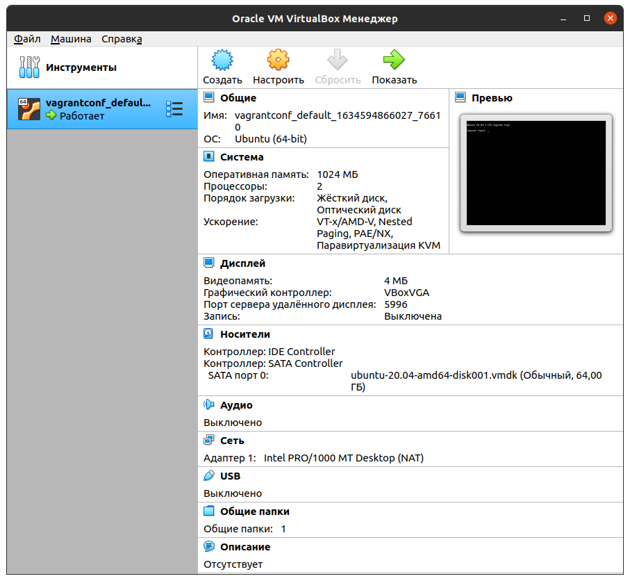
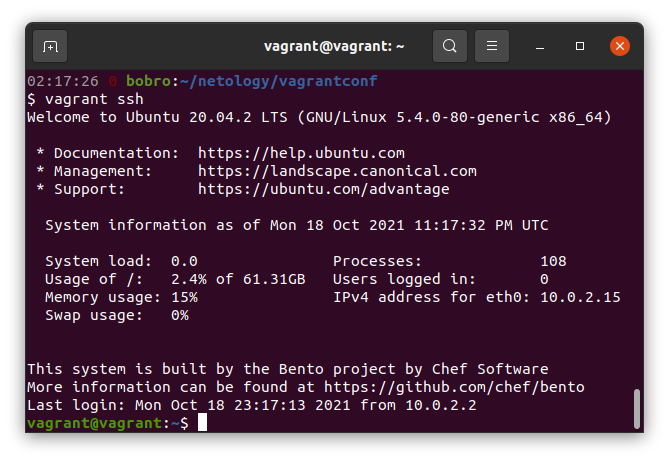
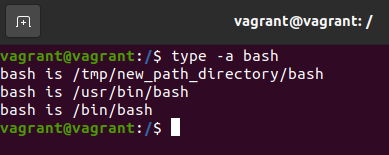

## Домашнее задание к занятию "3.1. Работа в терминале, лекция 1"  
Для обучения изначально поставил себе UBUNTU VERSION="20.04.3 LTS (Focal Fossa)" на внешний SSD :)
1. _Установите средство виртуализации Oracle VirtualBox._  
2. _Установите средство автоматизации Hashicorp Vagrant._  
3. _В вашем основном окружении подготовьте удобный для дальнейшей работы терминал._  
4. _С помощью базового файла конфигурации запустите Ubuntu 20.04 в VirtualBox посредством Vagrant._  
5. _Ознакомьтесь с графическим интерфейсом VirtualBox, посмотрите как выглядит виртуальная машина, которую создал для вас Vagrant, какие аппаратные ресурсы ей выделены. Какие ресурсы выделены по-умолчанию?_  
  
Выделенные ресурсы: 2 CPU, 1Gb RAM, 64Gb HDD, 4Mb VRAM, Сетевой адаптер  
6. _Ознакомьтесь с возможностями конфигурации VirtualBox через Vagrantfile: документация. Как добавить оперативной памяти или ресурсов процессора виртуальной машине?_    
Добавить в файл конфигурации запись:
> config.vm.provider "virtualbox" do |v|  
  v.memory = <количество памяти в МБ>  
  v.cpus = <количество CPU>  
end

7. _Команда vagrant ssh из директории, в которой содержится Vagrantfile, позволит вам оказаться внутри виртуальной машины без каких-либо дополнительных настроек. Попрактикуйтесь в выполнении обсуждаемых команд в терминале Ubuntu._  
  
8. _Ознакомиться с разделами man bash, почитать о настройках самого bash:_  
+ _какой переменной можно задать длину журнала history, и на какой строчке manual это описывается?_
> Длина файла журнала HISTFILESIZE описывается со строки `The maximum number of lines contained in the history file.`, либо в общем разделе про HISTORY `...more than the number of lines specified by the value of HISTFILESIZE.  If HISTFILESIZE is unset, or set to null, a non-numeric value, or a numeric value less than zero, the  history  file is  not  truncated.`

+ _что делает директива ignoreboth в bash?_  
> Применяет для истории команд одновременно две директивы ignorespace и ignoredups, т.е указывает не записывать в историю команды начинающиеся с пробела и повторяющиеся команды

9. _В каких сценариях использования применимы скобки {} и на какой строчке man bash это описано?_  
>+ {} или brace используются для группового выполнения команд, строка  `{ list; } list  is simply executed in the current shell environment.`  
>+ определения функций, описано в разделе `Shell Function Definitions`  
>+ используются для работы с массивами, описано в разделе `Arrays` `...Any element of an array may be referenced using ${name[subscript]}.  The braces are required to avoid conflicts with pathname expansion.`  
>+ Brace expansion - генерация составных строк в командной строке, описано на строке `A sequence expression takes the form {x..y[..incr]}`  
>+ Parameter Expansion - работа с параметрами (переменными), строка ` ${parameter} The value of parameter is substituted.  The braces are required when parameter is a positional parameter with more than one digit, or when parameter is followed by a  character  which is not to be interpreted as part of its name.`  
>+ При настройке командной строки, описано в строке `\D{format} the format is passed to strftime(3) and the result is inserted into the prompt string; an empty format results in a locale-specific time representation.   The  braces  are  required`  

10. _С учётом ответа на предыдущий вопрос, как создать однократным вызовом touch 100000 файлов?_  
> touch file-{1..100000}  

_Получится ли аналогичным образом создать 300000? Если нет, то почему?_  
> Нет. Получаем ошибку -bash: /usr/bin/touch: Argument list too long.  
> Это связано с ограничением на максимальную длину вводимой команды. Нашел через терминал такое число: Maximum length of command we could actually use: 2090740  

11. _В man bash поищите по `/\[\[`. Что делает конструкция [[ -d /tmp ]]_  
> Конструкция проверяет существует и является ли директорией /tmp

12. _Основываясь на знаниях о просмотре текущих (например, PATH) и установке новых переменных; командах, которые мы рассматривали, добейтесь в выводе type -a bash в виртуальной машине наличия первым пунктом в списке._  
> `mkdir /tmp/new_path_directory/ && > /tmp/new_path_directory/bash && chmod u+x /tmp/new_path_directory/bash`   
> `PATH="/tmp/new_path_directory:$PATH"`  

13. _Чем отличается планирование команд с помощью batch и at?_  
> at - выполняет задачи в/через указанное время  
> batch - выполняет задачи только когда загрузка системы (load average) ниже определенного лимита (по умолчанию 1.5)
