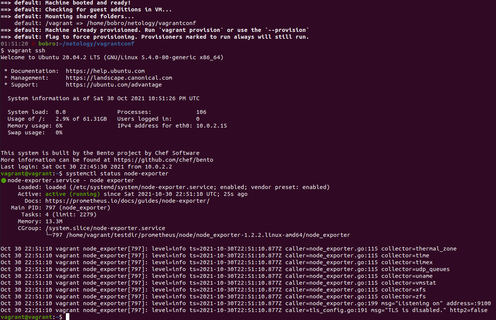
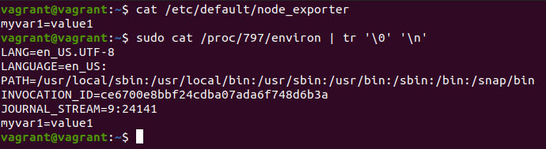
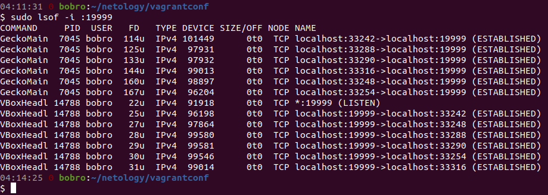
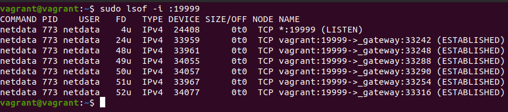
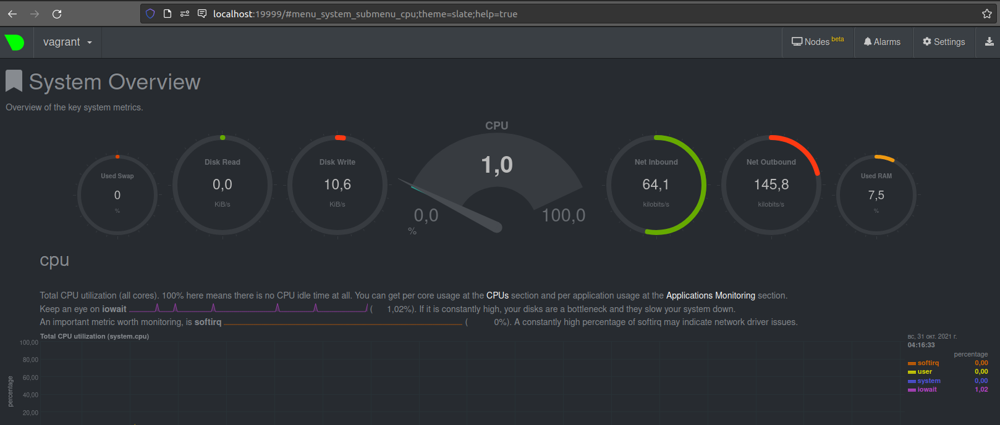
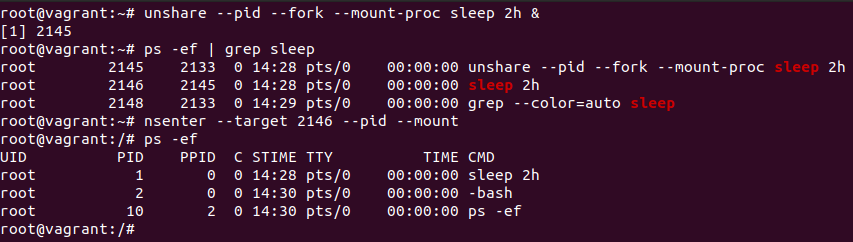

## Домашнее задание к занятию "3.4. Операционные системы, лекция 2"

1. _На лекции мы познакомились с [node_exporter](https://github.com/prometheus/node_exporter/releases). В демонстрации его исполняемый файл запускался в background. Этого достаточно для демо, но не для настоящей production-системы, где процессы должны находиться под внешним управлением. Используя знания из лекции по systemd, создайте самостоятельно простой [unit-файл](https://www.freedesktop.org/software/systemd/man/systemd.service.html) для node_exporter:_  
    * поместите его в автозагрузку,
    * предусмотрите возможность добавления опций к запускаемому процессу через внешний файл (посмотрите, например, на `systemctl cat cron`),
    * удостоверьтесь, что с помощью systemctl процесс корректно стартует, завершается, а после перезагрузки автоматически поднимается.
> Содержимое файла .service:
```vagrant@vagrant:~$ cat /etc/systemd/system/node-exporter.service 
[Unit]
Description=node exporter
Documentation=https://prometheus.io/docs/guides/node-exporter/
After=multi-user.target
 
[Service]
ExecStart=/home/vagrant/testdir/prometheus/node/node_exporter-1.2.2.linux-amd64/node_exporter
EnvironmentFile=/etc/default/node_exporter
 
[Install]
WantedBy=multi-user.target
```
> Старт VM и проверка автозагрузки:  


> Проверка загруженной переменой:  

2. _Ознакомьтесь с опциями node_exporter и выводом `/metrics` по-умолчанию. Приведите несколько опций, которые вы бы выбрали для базового мониторинга хоста по CPU, памяти, диску и сети._  
> --collector.cpu  
--collector.cpufreq  
--collector.diskstats  
--collector.loadavg  
--collector.meminfo  
--collector.netdev  
--collector.netstat  

3. _Установите в свою виртуальную машину [Netdata](https://github.com/netdata/netdata). Воспользуйтесь [готовыми пакетами](https://packagecloud.io/netdata/netdata/install) для установки (`sudo apt install -y netdata`). После успешной установки:_  
    _* в конфигурационном файле `/etc/netdata/netdata.conf` в секции [web] замените значение с localhost на `bind to = 0.0.0.0`,_  
    _* добавьте в Vagrantfile проброс порта Netdata на свой локальный компьютер и сделайте `vagrant reload`:_  

    ```bash
    config.vm.network "forwarded_port", guest: 19999, host: 19999
    ```

    _После успешной перезагрузки в браузере *на своем ПК* (не в виртуальной машине) вы должны суметь зайти на `localhost:19999`. Ознакомьтесь с метриками, которые по умолчанию собираются Netdata и с комментариями, которые даны к этим метрикам._
> Порт 19999 на хосте и виртуальной машине:



> Netdata в браузере:

4. _Можно ли по выводу `dmesg` понять, осознает ли ОС, что загружена не на настоящем оборудовании, а на системе виртуализации?_
> Можно. Осознаёт:
```
> Hypervisor detected: KVM  
> CPU MTRRs all blank - virtualized system.  
> Booting paravirtualized kernel on KVM  
> systemd[1]: Detected virtualization oracle.  
```
5. _Как настроен sysctl `fs.nr_open` на системе по-умолчанию? Узнайте, что означает этот параметр. Какой другой существующий лимит не позволит достичь такого числа (`ulimit --help`)?_
> Узнаем значение параметра по умолчанию `sysctl -n fs.nr_open`: 1048576 - это лимит на количество открытых файловых дескрипторов в ОС.  
> Достигнуть такого числа может не позволить заданный жесткий лимит для оболочки. Его значение можно узнать командой `ulimit -Hn`. В нашей VM значение совпадает с fs.nr_open. 
6. _Запустите любой долгоживущий процесс (не `ls`, который отработает мгновенно, а, например, `sleep 1h`) в отдельном неймспейсе процессов; покажите, что ваш процесс работает под PID 1 через `nsenter`. Для простоты работайте в данном задании под root (`sudo -i`). Под обычным пользователем требуются дополнительные опции (`--map-root-user`) и т.д._
>
7. _Найдите информацию о том, что такое `:(){ :|:& };:`. Запустите эту команду в своей виртуальной машине Vagrant с Ubuntu 20.04 (**это важно, поведение в других ОС не проверялось**). Некоторое время все будет "плохо", после чего (минуты) – ОС должна стабилизироваться. Вызов `dmesg` расскажет, какой механизм помог автоматической стабилизации. Как настроен этот механизм по-умолчанию, и как изменить число процессов, которое можно создать в сессии?_  

> Это "fork bomb" :) - функция с именем `:`, которая вызывает 2 экземпляра самой себя (второй из них в фоне). Таким образом при запуске данной конструкции в геометрической прогрессии будет плодиться количество одновременно запущенных процессов в сессии.  
> В выводе `dmesg` в строке `cgroup: fork rejected by pids controller in /user.slice/user-1000.slice/session-7.scope` выясняем, что стабилизировал ситуацию pids controller - часть механизма `cgroups` или Control Groups.  
> Контроллер отклонял выдачу PID, когда число процессов в сессии 7 для пользователя 1000 достигло лимита. Данный лимит указан в файле: `/sys/fs/cgroup/pids/user.slice/user-1000.slice/session-7.scope/pids.max`. Значение можно изменить, например, командой `echo 100 > /sys/fs/cgroup/pids/user.slice/каталог_сессии_пользователя/pids.max`. Для снятия лимита нужно передать значение `max`.  
> Также значение максимального количества процессов для текущего пользователя можно изменить командой `ulimit -u 100`.