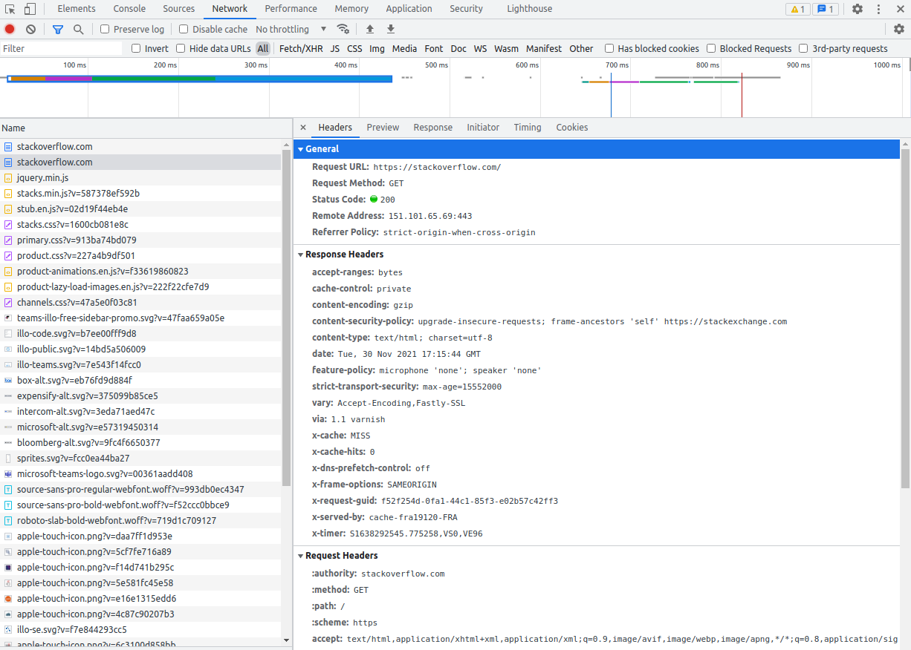
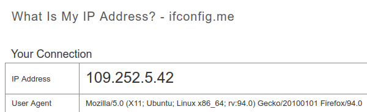
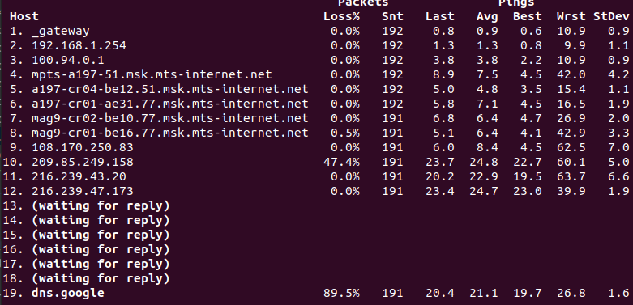

## Домашнее задание к занятию "3.6. Компьютерные сети, лекция 1"

1. _Работа c HTTP через телнет._
- Подключитесь утилитой телнет к сайту stackoverflow.com
`telnet stackoverflow.com 80`
- отправьте HTTP запрос
```bash
GET /questions HTTP/1.0
HOST: stackoverflow.com
[press enter]
[press enter]
```
- В ответе укажите полученный HTTP код, что он означает?  
> Ответ: HTTP/1.1 301 Moved Permanently  
> Код означает, что запрашиваемый ресурс был перемещен на постоянной основе.  
> Адрес нового размещения указан в поле location: https://stackoverflow.com/questions  
2. _Повторите задание 1 в браузере, используя консоль разработчика F12._
- откройте вкладку `Network`
- отправьте запрос http://stackoverflow.com
- найдите первый ответ HTTP сервера, откройте вкладку `Headers`
- укажите в ответе полученный HTTP код.
- проверьте время загрузки страницы, какой запрос обрабатывался дольше всего?
- приложите скриншот консоли браузера в ответ.
>FireFox в "Network" вообще не отобразил код 301, а первый ответ на запрос https://stackoverflow.com/ уже 200. Т.е. скрыл, что было перенаправление. Видимо, вшитые настройки с пробрасыванием на https.  
> В Chrome первый раз ответ был 301, а последующие попытки "307 Internal Redirect".  
> Если отсортировать по колонке "time", то самое большое время обрабатывался запрос https://stackoverflow.com/  
> 
3. _Какой IP адрес у вас в интернете?_
>
4. _Какому провайдеру принадлежит ваш IP адрес? Какой автономной системе AS? Воспользуйтесь утилитой `whois`_
> descr: Moscow Local Telephone Network (OAO MGTS) - провайдер МГТС   
> descr: Moscow, Russia  
> origin: AS25513 - автономная система 25513  
5. _Через какие сети проходит пакет, отправленный с вашего компьютера на адрес 8.8.8.8? Через какие AS? Воспользуйтесь утилитой `traceroute`_  
```
traceroute to 8.8.8.8 (8.8.8.8), 30 hops max, 60 byte packets
 1  192.168.0.1 [*]  1.472 ms  2.836 ms  2.814 ms
 2  192.168.1.254 [*]  2.911 ms  3.092 ms  3.074 ms
 3  100.94.0.1 [AS263124]  6.322 ms  6.695 ms  7.150 ms
 4  212.188.1.106 [AS8359]  11.156 ms  11.539 ms  11.504 ms
 5  212.188.1.105 [AS8359]  9.545 ms  11.257 ms  11.445 ms
 6  212.188.56.13 [AS8359]  11.429 ms  6.904 ms  6.506 ms
 7  195.34.50.74 [AS8359]  7.722 ms  8.246 ms  8.228 ms
 8  212.188.29.82 [AS8359]  8.348 ms  8.331 ms  8.422 ms
 9  108.170.250.113 [AS15169]  8.692 ms 108.170.250.99 [AS15169]  9.430 ms 108.170.250.130 [AS15169]  9.652 ms
10  142.251.49.24 [AS15169]  24.048 ms 216.239.51.32 [AS15169]  26.078 ms 209.85.255.136 [AS15169]  24.667 ms
11  74.125.253.109 [AS15169]  26.296 ms 74.125.253.94 [AS15169]  30.940 ms 216.239.57.222 [AS15169]  24.344 ms
12  216.239.54.201 [AS15169]  20.455 ms 209.85.254.179 [AS15169]  24.926 ms 216.239.57.229 [AS15169]  22.457 ms
13  * * *
14  * * *
15  * * *
16  * * *
17  * * *
18  * * *
19  * * *
20  * * *
21  * * *
22  8.8.8.8 [AS15169]  25.494 ms *  27.325 ms
```
> Точки 1-2 - видимо мой wifi-роутер и оптический модем МГТС  
> Точка 3  100.94.0.1 [AS263124]  - принадлежит IANA для спец. использования
> Точки 4-8 [AS8359] - провайдер MTS (MTU-intel)
> Точки 9-22 [AS15169] - GOOGLE
6. _Повторите задание 5 в утилите `mtr`. На каком участке наибольшая задержка - delay?_  
> 
> В динамике примерно одинаковая задержка в диапазоне точек 10-19. Худшая точка - 10. На ней теряем половину пакетов.
7. _Какие DNS сервера отвечают за доменное имя dns.google? Какие A записи? воспользуйтесь утилитой `dig`_
> Используем команду `dig +trace dns.google`. Проход через цепочку серверов:  
> f.root-servers.net  
> ns-tld5.charlestonroadregistry.com  
> ns3.zdns.google  
> И с последнего получена информация о dns.google:  
> dns.google.		900	IN	A	8.8.8.8  
> dns.google.		900	IN	A	8.8.4.4

8. _Проверьте PTR записи для IP адресов из задания 7. Какое доменное имя привязано к IP? воспользуйтесь утилитой `dig`_
> `dig -x 8.8.4.4 -x 8.8.8.8`
> ```
> ;; ANSWER SECTION:
> 4.4.8.8.in-addr.arpa.	7108	IN	PTR	dns.google.
>
> ;; ANSWER SECTION:
> 8.8.8.8.in-addr.arpa.	4246	IN	PTR	dns.google.
> ```
