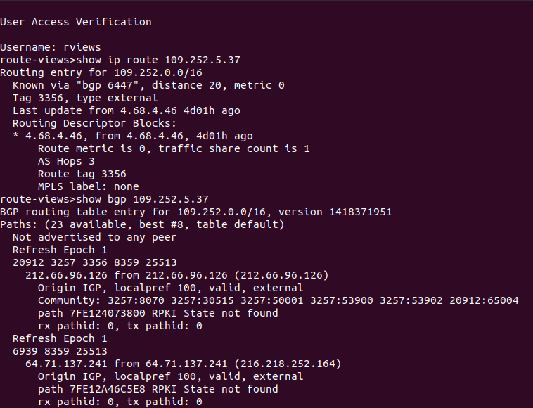

## Домашнее задание к занятию "3.8. Компьютерные сети, лекция 3"

1. _Подключитесь к публичному маршрутизатору в интернет. Найдите маршрут к вашему публичному IP_  
```
telnet route-views.routeviews.org
Username: rviews
show ip route x.x.x.x/32
show bgp x.x.x.x/32
```

2. _Создайте dummy0 интерфейс в Ubuntu. Добавьте несколько статических маршрутов. Проверьте таблицу маршрутизации._


3. _Проверьте открытые TCP порты в Ubuntu, какие протоколы и приложения используют эти порты? Приведите несколько примеров._
> Проверим все открытые порты с помощью команды `ss`. Для отображения всех только TCP сокетов и процессов из использующих используем ключи -tap. Также для разрешения имен хостов можно использовать -r.  
> `ss -tapr`  
> Часть таблицы с сокетами TCP:
```
State             Recv-Q        Send-Q               Local Address:Port                                                      Peer Address:Port         Process                                             
LISTEN            0             10                       localhost:2222                                                           0.0.0.0:*             users:(("VBoxHeadless",pid=16433,fd=21))           
LISTEN            0             4096                  localhost%lo:53                                                             0.0.0.0:*             users:(("systemd-resolve",pid=935,fd=13))          
LISTEN            0             5                        localhost:631                                                            0.0.0.0:*             users:(("cupsd",pid=1128,fd=7))                    
ESTAB             0             0                        localhost:59090                                                        localhost:2222          users:(("ssh",pid=17013,fd=3))          
ESTAB             0             0                    bobro-desktop:33450                                  lb-140-82-113-25-iad.github.com:443           users:(("GeckoMain",pid=11346,fd=55))              
ESTAB             0             0                        localhost:40592                                                        localhost:63342         users:(("jcef_helper",pid=15434,fd=25))                        
ESTAB             0             0                    bobro-desktop:41364                                                   149.154.167.51:443           users:(("telegram-deskto",pid=10413,fd=20))        
ESTAB             0             0                    bobro-desktop:51884                                                   193.238.46.233:443           users:(("GeckoMain",pid=11346,fd=64))              
CLOSE-WAIT        64            0                    bobro-desktop:51106                        server-52-85-47-17.hel50.r.cloudfront.net:443           users:(("java",pid=15314,fd=155))
ESTAB             0             0                        localhost:63342                                                        localhost:40600         users:(("java",pid=15314,fd=126))
```
> Локальный порт 53 - протокол DNS. Стандартный порт сервиса разрешения доменных имён.  
> Удаленный порт 631 - протокол HTTP. Стандартный порт для сервиса печати CUPS.  
> Удаленный порт 443 - стандартный порт для соединения по безопасному протоколу HTPPS. В таблице процессы браузера firefox (GeckoMain) и мессенджера telegram.  
> На локальном локальный порту 2222 прослушиваются соединения гипервизором VirtualBox. По этому порту установлено SSH соединение с VM.  
> Также стандартные, часто используемые порты: 80 (HTTP, различные приложения), 25 (SMTP, почтовые клиенты), 22 (SSH, клиенты для подключений ssh).  
 
4. _Проверьте используемые UDP сокеты в Ubuntu, какие протоколы и приложения используют эти порты?_  
> Аналогично предыдущему пункту командой можно посмореть все сокеты UDP, используя вместо ключа -t, ключ -u :  
> `ss -uapr`
```
State                  Recv-Q                 Send-Q                                        Local Address:Port                                   Peer Address:Port                 Process                 
UNCONN                 0                      0                                             127.0.0.53%lo:53                                          0.0.0.0:*                                            
ESTAB                  0                      0                                      192.168.0.110%wlp3s0:68                                      192.168.0.1:67                                           
UNCONN                 0                      0                                                   0.0.0.0:631                                         0.0.0.0:*                                            
UNCONN                 0                      0                                                   0.0.0.0:59158                                       0.0.0.0:*                                            
UNCONN                 0                      0                                                   0.0.0.0:5353                                        0.0.0.0:*                                            
UNCONN                 0                      0                                                      [::]:32863                                          [::]:*                                            
UNCONN                 0                      0                                                      [::]:5353                                           [::]:*                                            
```
> Видим аналогичные стандартные порты UDP53 (DNS) и UDP631 (CUPS), а также соединение установленное через порты 67 и 68. Если использовать ключ -r, то можно увидеть, что это протокол BOOTP. 
5. _Используя diagrams.net, создайте L3 диаграмму вашей домашней сети или любой другой сети, с которой вы работали._ 

 ---
### Задание для самостоятельной отработки (необязательно к выполнению)

6*. Установите Nginx, настройте в режиме балансировщика TCP или UDP.

7*. Установите bird2, настройте динамический протокол маршрутизации RIP.

8*. Установите Netbox, создайте несколько IP префиксов, используя curl проверьте работу API.

 ---
