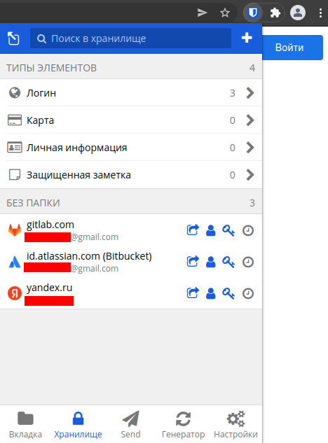
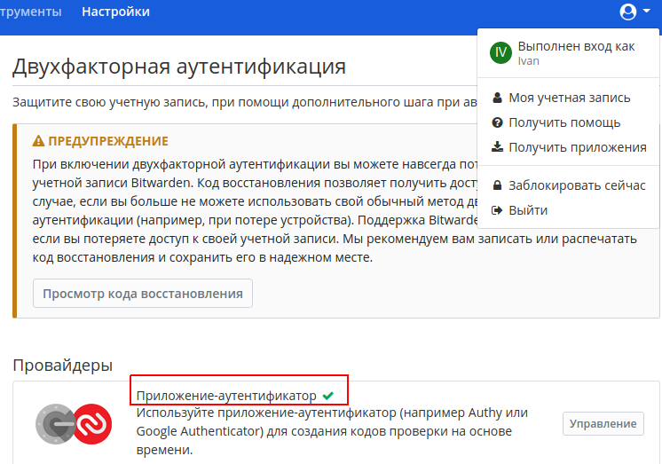
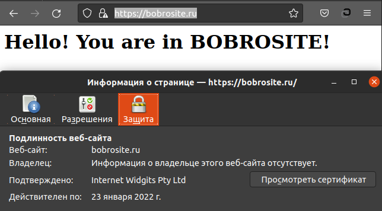
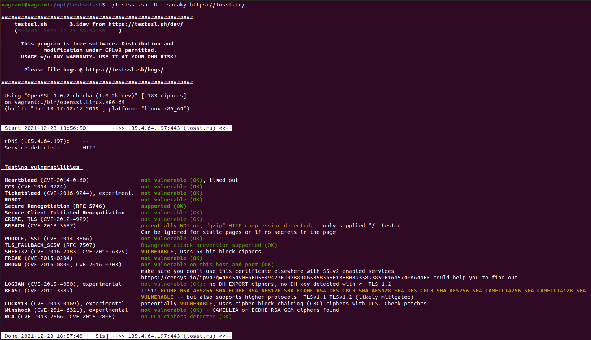
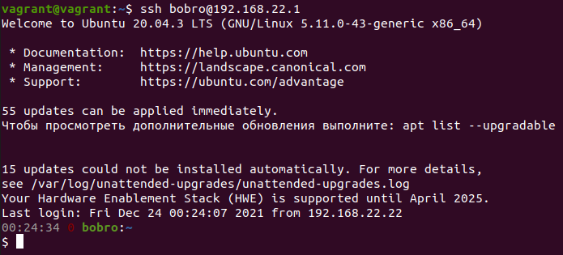
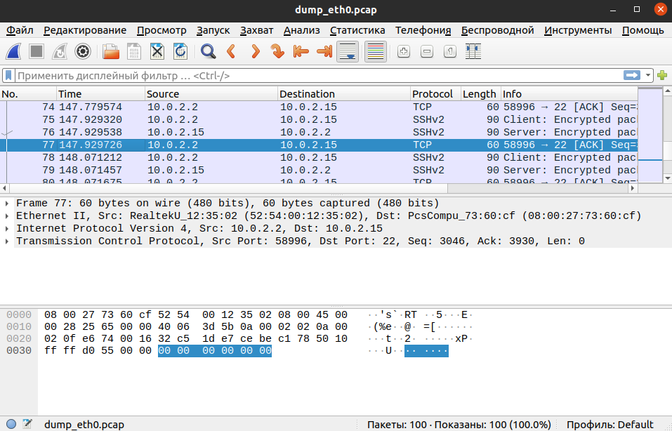
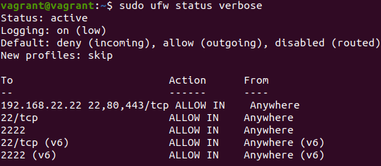

## Домашнее задание к занятию "3.9. Элементы безопасности информационных систем"

1. _Установите Bitwarden плагин для браузера. Зарегестрируйтесь и сохраните несколько паролей._  

2. _Установите Google authenticator на мобильный телефон. Настройте вход в Bitwarden акаунт через Google authenticator OTP.

3. _Установите apache2, сгенерируйте самоподписанный сертификат, настройте тестовый сайт для работы по HTTPS._  
> Сервер apache устанавливал на VM. Добавил в конфиг Vagrantfile строку с IP своего сайта:  
> `config.vm.network "private_network", ip: "192.168.22.22"`  
> Далее устанавливаем сервер, подключаем модуль SSL, генерируем приватный ключ и сертификат:  
> ```
> sudo apt install apache2
> sudo systemctl enable apache2
> sudo a2enmod ssl
> sudo systemctl restart apache2
> sudo openssl req -x509 -nodes -days 31 -newkey rsa:2048 -keyout /etc/ssl/private/apache-ss.key -out /etc/ssl/certs/apache-ss.crt
> ```
> Настраиваем конфиг сайта:
> ```
> cd /etc/apache2/sites-available/  
> sudo mv 000-default.conf bobrosite.conf && sudo nano bobrosite.conf
> 
> <VirtualHost *:443>
>        ServerName bobrosite.ru
>        ServerAlias www.bobrosite.ru
>        DocumentRoot /var/www/bobrosite.ru
>
>        SSLEngine on
>        SSLCertificateFile /etc/ssl/certs/apache-ss.crt
>        SSLCertificateKeyFile /etc/ssl/private/apache-ss.key
>
>       ErrorLog ${APACHE_LOG_DIR}/error.log
>        CustomLog ${APACHE_LOG_DIR}/access.log combined 
> </VirtualHost>
> 
>  sudo mkdir /var/www/bobrosite.ru
>  sudo nano /var/www/bobrosite.ru/index.html
>  sudo a2ensite bobrosite.conf
>  sudo apache2ctl configtest
> 
> Записываем в /etc/hosts строку `192.168.22.22   bobrosite.ru` и перезапускаем VM.  
> Заходим по ссылке https://bobrosite.ru:
> ```
  
4. _Проверьте на TLS уязвимости произвольный сайт в интернете (кроме сайтов МВД, ФСБ, МинОбр, НацБанк, РосКосмос, РосАтом, РосНАНО и любых госкомпаний, объектов КИИ, ВПК ... и тому подобное)._    

5. _Установите на Ubuntu ssh сервер, сгенерируйте новый приватный ключ. Скопируйте свой публичный ключ на другой сервер. Подключитесь к серверу по SSH-ключу._
> На ВМ SSH уже настроен. Поэтому попробуем в обратную сторону. Устанавливаем ssh сервер на хостовой машине:    
> ```
> sudo apt install openssh-server
> sudo systemctl enable sshd.service && systemctl status sshd.service 
> ```
> В п.3 ДЗ указывали в конфиге vagrant IP виртуальной машины в результате чего появилась сеть 192.168.22.0/24, к которой принадлежат и хост и ВМ.  
> Чтобы попасть по SSH с ВМ на хост узнаем на хосте адрес интерфейса в этой сети, например, командой `ip -4 address`. Это `192.168.22.1`.  
> Сгенерируем ssh ключи c помощью утилиты `ssh-keygen` на ВМ.  
> ```
> vagrant@vagrant:~$ ssh-keygen
> Generating public/private rsa key pair.
> Enter file in which to save the key (/home/vagrant/.ssh/id_rsa): bobrokey
> Enter passphrase (empty for no passphrase): 
> Enter same passphrase again: 
> Your identification has been saved in bobrokey
> Your public key has been saved in bobrokey.pub
> The key fingerprint is:
> SHA256:0pxsYnM6hisE270BkQ4LenM2aEdNdPkZLHT9wpbM29w vagrant@vagrant
> ```
> Скопируем содержимое файла публичного ключа bobrokey.pub в файл ~/.ssh/authorized_keys на хостовой машине и перезапустим sshd. Теперь есть возможность попасть на сервер по ssh без ввода пароля.    
>  
6. _Переименуйте файлы ключей из задания 5. Настройте файл конфигурации SSH клиента, так чтобы вход на удаленный сервер осуществлялся по имени сервера._  
> ```
> mv ~/.ssh/bobrokey ~/.ssh/bobrokey_renamed
> mv ~/.ssh/bobrokey.pub ~/.ssh/bobrokey_renamed.pub
> ```
> Для того чтобы вход по ssh осуществлялся по псевдониму сервера можно настроить файл клиента `~/.ssh/config`  
> ```
> Host bobro
>       Hostname 192.168.22.1
>       User bobro
>       PasswordAuthentication no
>       IdentityFile ~/.ssh/id_rsa
> ```
> Теперь можно осуществить вход командой `ssh bobro`  

7. _Соберите дамп трафика утилитой tcpdump в формате pcap, 100 пакетов. Откройте файл pcap в Wireshark._  
> `tcpdump -w dump_eth0.pcap -c 100 -i eth0`  
>
 ---
### Задание для самостоятельной отработки (необязательно к выполнению)

8*. _Просканируйте хост scanme.nmap.org. Какие сервисы запущены?_  
```
vagrant@vagrant:~$ sudo nmap -sV scanme.nmap.org
Starting Nmap 7.80 ( https://nmap.org ) at 2021-12-23 22:35 UTC
Nmap scan report for scanme.nmap.org (45.33.32.156)
Host is up (0.19s latency).
Other addresses for scanme.nmap.org (not scanned): 2600:3c01::f03c:91ff:fe18:bb2f
Not shown: 996 closed ports
PORT      STATE SERVICE    VERSION
22/tcp    open  ssh        OpenSSH 6.6.1p1 Ubuntu 2ubuntu2.13 (Ubuntu Linux; protocol 2.0)
80/tcp    open  http       Apache httpd 2.4.7 ((Ubuntu))
9929/tcp  open  nping-echo Nping echo
31337/tcp open  tcpwrapped
Service Info: OS: Linux; CPE: cpe:/o:linux:linux_kernel

Service detection performed. Please report any incorrect results at https://nmap.org/submit/ .
Nmap done: 1 IP address (1 host up) scanned in 10.77 seconds
```

9*. _Установите и настройте фаервол ufw на web-сервер из задания 3. Откройте доступ снаружи только к портам 22,80,443_ 
