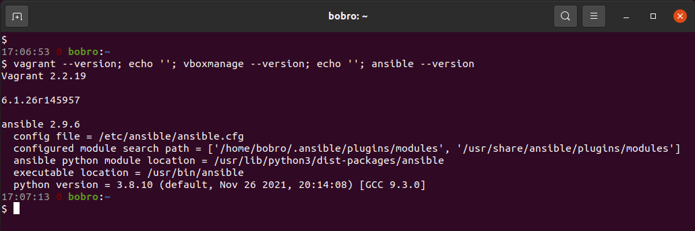
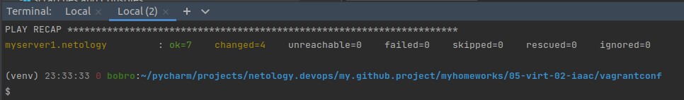
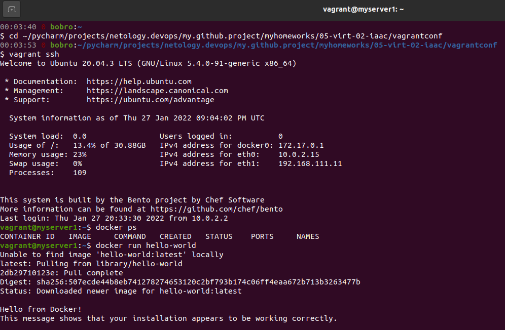

# Домашнее задание к занятию "5.2. Применение принципов IaaC в работе с виртуальными машинами"

## Как сдавать задания

Обязательными к выполнению являются задачи без указания звездочки. Их выполнение необходимо для получения зачета и диплома о профессиональной переподготовке.

Задачи со звездочкой (*) являются дополнительными задачами и/или задачами повышенной сложности. Они не являются обязательными к выполнению, но помогут вам глубже понять тему.

Домашнее задание выполните в файле readme.md в github репозитории. В личном кабинете отправьте на проверку ссылку на .md-файл в вашем репозитории.

Любые вопросы по решению задач задавайте в чате учебной группы.

---

## Задача 1

- Опишите своими словами основные преимущества применения на практике IaaC паттернов.
- Какой из принципов IaaC является основополагающим?
> Преимущества применения IaaC:
> - Однообразность и стабильность разворачиваемых сред (отсутствие дрейфа конфигураций). Все команды разработки, тестирования и системных инженеров знают, что вне зависимости от среды код везде будет исполняться одинаково. Это исключает траты времени на поиск ошибок в настройке инфраструктуры и позволяет сфокусироваться в ошибках только ПО (невозможность объяснить ошибки или нестабильность работы ПО различными настройками на средах).  
> - Повышение скорости и уменьшение затрат на разворачивание, модификацию и масштабирование сред, что в конечном итоге значительно ускоряет вывод новых продуктов в промышленную эксплуатацию и позволяет поддерживать производительность уже развернутых систем в соответствии с требованиями и с минимальными усилиями. Для типовых проектов уже могут иметься наработанные ранее готовые конфигурации инфраструктуры, либо требующие незначительной доработки перед развертыванием.  
> - Более быстрая разработка и доставка в продуктивную систему новых фич за счет высокой скорости предоставления сред командам разработки и тестирования. При этом использование для доставки кода и тестирования на разворачиваемых средах инструментов CI/CD значительно ускоряет и упрощает разработку и повышает качество кода.  
> - Практически безболезненное восстановление инфраструктуры в аварийных ситуациях. Например, при частичной или полной потере серверов в дата-центре, при условии, сохраненных в другом месте бэкапов с данными.  
> 
> Основополагающий принцип подхода IaaC - идемпотентность. Т.е. нам достаточно единожды описать конфигурацию инфраструктуры, чтобы затем автоматически разворачивать среды неограниченное количество раз и всегда с одинаковым результатом. Таким образом и достигаются преимущества, описанные выше.

## Задача 2

- Чем Ansible выгодно отличается от других систем управление конфигурациями?  
> Ansible не требует дополнительной установки на ВМ специального окружения. Для начала использования достаточно настроенного на виртуальной машине SSH доступа. Также Ansible обладает низким порогом входа и использует широкораспространенные Python и YAML.  
- Какой, на ваш взгляд, метод работы систем конфигурации более надёжный push или pull?
> На мой взгляд более надежный pull. ВМ сама запрашивает конфигурацию в момент работоспособности, что гарантирует доставку этой конфигурации. В случае push некоторые ВМ могут оказаться недоступны в момент доставки конфигураций, что может повлечь за собой расхождения в них. Также при подходе push мы имеем доступ ко всем ВМ, что менее безопасно, чем использование pull, когда каждая из ВМ имеет доступ только к серверу конфигураций.

## Задача 3

Установить на личный компьютер:

- VirtualBox
- Vagrant
- Ansible

*Приложить вывод команд установленных версий каждой из программ, оформленный в markdown.*

## Задача 4 (*)

Воспроизвести практическую часть лекции самостоятельно.

- Создать виртуальную машину.
- Зайти внутрь ВМ, убедиться, что Docker установлен с помощью команды

