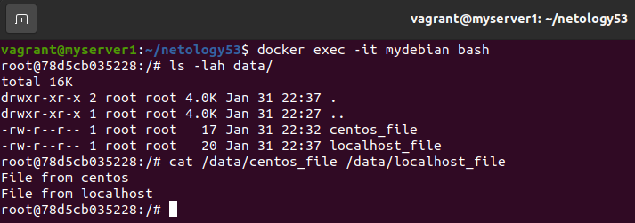

# Домашнее задание к занятию "5.3. Введение. Экосистема. Архитектура. Жизненный цикл Docker контейнера"

## Как сдавать задания

Обязательными к выполнению являются задачи без указания звездочки. Их выполнение необходимо для получения зачета и диплома о профессиональной переподготовке.

Задачи со звездочкой (*) являются дополнительными задачами и/или задачами повышенной сложности. Они не являются обязательными к выполнению, но помогут вам глубже понять тему.

Домашнее задание выполните в файле readme.md в github репозитории. В личном кабинете отправьте на проверку ссылку на .md-файл в вашем репозитории.

Любые вопросы по решению задач задавайте в чате учебной группы.

---

## Задача 1

Сценарий выполения задачи:

- создайте свой репозиторий на https://hub.docker.com;
- выберете любой образ, который содержит веб-сервер Nginx;
- создайте свой fork образа;
- реализуйте функциональность:
запуск веб-сервера в фоне с индекс-страницей, содержащей HTML-код ниже:
```
<html>
<head>
Hey, Netology
</head>
<body>
<h1>I’m DevOps Engineer!</h1>
</body>
</html>
```
Опубликуйте созданный форк в своем репозитории и предоставьте ответ в виде ссылки на https://hub.docker.com/username_repo.  
> https://hub.docker.com/layers/189796975/bobro777/netology/mynginx_0.1/images/sha256-0c217b8e288c32b968ef2de100d8432a241888b039f54c93617634eee5cc70ce?context=repo

## Задача 2

Посмотрите на сценарий ниже и ответьте на вопрос:
"Подходит ли в этом сценарии использование Docker контейнеров или лучше подойдет виртуальная машина, физическая машина? Может быть возможны разные варианты?"

Детально опишите и обоснуйте свой выбор.

--

Сценарий:

- Высоконагруженное монолитное java веб-приложение;
> Если архитектура приложения подразумевает возможность и необходимость частого масштабирования и/или обновления, то можно использовать Docker. В противном случае будет лучше использовать кластер из физических серверов, чтобы не тратить ресурсы на виртуализацию.
- Nodejs веб-приложение;
> Для таких веб-приложений предпочтительно использование Docker. Тем более на докерхаб есть официальный образ node в трех вариантах исполнения. Использование docker позволит быстро развернуть приложение на всех средах.
- Мобильное приложение c версиями для Android и iOS;
> Для организации бэкэнда мобильных приложений использование Docker вполне обоснованно. При динамичном развитии таких приложений, главными преимуществами тут будут возможность частых разворачиваний сборок и масштабируемость. Также для масштабных приложений с большим количеством серверов, разнесенных территориально будет плюсом простота доставки и развертывания на различных площадках.  
> Что касается клиентских приложений, то описания для Android по созданию docker образов нашел, а для iOS - нет. Ну и контейнеризация, на мой взгляд, в данном случае актуальна только для отладки и тестирования, либо какие-то решения требующие особой изоляции приложений (может быть безопасная среда для банковского ПО).
- Шина данных на базе Apache Kafka;
> Архитектура Kafka очень хорошо подходит для использования в Docker. С помощью контейнеров можно организовать отказоустойчивый кластер из множества брокеров с хранением данных очередей где-нибудь в NFS. Можно быстро развернуть, использую популярный образ bitnami/kafka. При необходимости кластер будет легко горизонтально масштабировать. 
- Elasticsearch кластер для реализации логирования продуктивного веб-приложения - три ноды elasticsearch, два logstash и две ноды kibana;
> Компоненты так называемого Elastic стека тоже подходят для использования в контейнерах Docker. На докерхаб есть официальные образы всех компонентов. Если увеличение количества нод не планируется и/или в других проектах не используется контейнеризация, то можно использовать и существующую инфраструктуру на ВМ.
- Мониторинг-стек на базе Prometheus и Grafana;
> Для данной задачи мониторинга Docker подойдет хорошо. Существуют официальные образы приложений стека. Единственное ограничение: не стоит разворачивать в контейнере node_exporter. Для его работы требуется прямой доступ к метрикам ядра, а в Docker он будет изолирован.
- MongoDB, как основное хранилище данных для java-приложения;
> Никаких проблем для использования в Docker контейнере. Есть официальный образ. Удобное и быстрое горизонтальное масштабирование.  
> Если уже есть технология разворачивания кластера MongoDB на виртуальных машинах и не планируется серьезного увеличения объемов данных/нагрузки, то можно использовать и их.
- Gitlab сервер для реализации CI/CD процессов и приватный (закрытый) Docker Registry.
> Если инженеры не используют контейнеризацию, то проще будет использовать ВМ или физический сервер. GitLab и Docker Registry не требуют масштабирования и постоянного редеплоя новых версий. Достаточно настроить бэкапирование данных средствами гипервизора или стороннего ПО. Но использование Docker также возможно.

## Задача 3

- Запустите первый контейнер из образа ***centos*** c любым тэгом в фоновом режиме, подключив папку ```/data``` из текущей рабочей директории на хостовой машине в ```/data``` контейнера;
- Запустите второй контейнер из образа ***debian*** в фоновом режиме, подключив папку ```/data``` из текущей рабочей директории на хостовой машине в ```/data``` контейнера;
- Подключитесь к первому контейнеру с помощью ```docker exec``` и создайте текстовый файл любого содержания в ```/data```;
- Добавьте еще один файл в папку ```/data``` на хостовой машине;
```
vagrant@myserver1:~/netology53$ docker run -it -d --name mycentos -v $(pwd)/data:/data centos
Unable to find image 'centos:latest' locally
latest: Pulling from library/centos
a1d0c7532777: Pull complete 
Digest: sha256:a27fd8080b517143cbbbab9dfb7c8571c40d67d534bbdee55bd6c473f432b177
Status: Downloaded newer image for centos:latest
4a6c2817e3f7084187a4539e090f7e934cc6ce683de2f736ae0c84bf7102ad3f
vagrant@myserver1:~/netology53$ docker run -it -d --name mydebian -v $(pwd)/data:/data debian
Unable to find image 'debian:latest' locally
latest: Pulling from library/debian
0c6b8ff8c37e: Pull complete 
Digest: sha256:fb45fd4e25abe55a656ca69a7bef70e62099b8bb42a279a5e0ea4ae1ab410e0d
Status: Downloaded newer image for debian:latest
78d5cb03522845aa34a1bd0a8bcdfa565dd17e2e16685fc7dd9d99ca97fea279
vagrant@myserver1:~/netology53$ docker ps
CONTAINER ID   IMAGE     COMMAND       CREATED              STATUS              PORTS     NAMES
78d5cb035228   debian    "bash"        16 seconds ago       Up 15 seconds                 mydebian
4a6c2817e3f7   centos    "/bin/bash"   About a minute ago   Up About a minute             mycentos
agrant@myserver1:~/netology53$ docker exec -it mycentos bash
[root@4a6c2817e3f7 /]# echo "File from centos" > /data/centos_file
[root@4a6c2817e3f7 /]# exit
exit
vagrant@myserver1:~/netology53$ sudo -i
root@myserver1:~# cd /home/vagrant/netology53/
root@myserver1:/home/vagrant/netology53# echo "File from localhost" > data/localhost_file
root@myserver1:/home/vagrant/netology53# exit
logout
 ```
- Подключитесь во второй контейнер и отобразите листинг и содержание файлов в ```/data``` контейнера.


## Задача 4 (*)

Воспроизвести практическую часть лекции самостоятельно.

Соберите Docker образ с Ansible, загрузите на Docker Hub и пришлите ссылку вместе с остальными ответами к задачам.
> https://hub.docker.com/repository/docker/bobro777/ansible

---

### Как cдавать задание

Выполненное домашнее задание пришлите ссылкой на .md-файл в вашем репозитории.

---