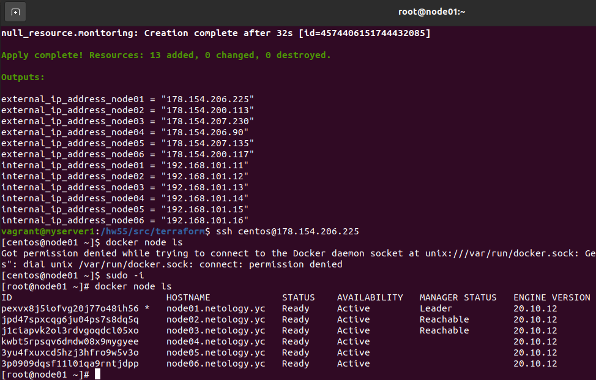
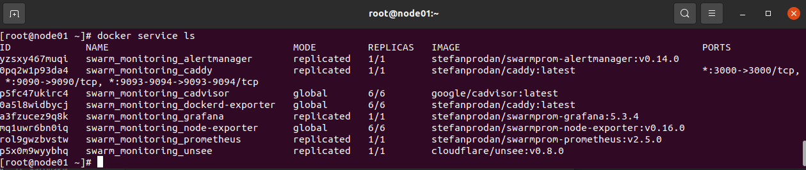

# Домашнее задание к занятию "5.5. Оркестрация кластером Docker контейнеров на примере Docker Swarm"

## Как сдавать задания

Обязательными к выполнению являются задачи без указания звездочки. Их выполнение необходимо для получения зачета и диплома о профессиональной переподготовке.

Задачи со звездочкой (*) являются дополнительными задачами и/или задачами повышенной сложности. Они не являются обязательными к выполнению, но помогут вам глубже понять тему.

Домашнее задание выполните в файле readme.md в github репозитории. В личном кабинете отправьте на проверку ссылку на .md-файл в вашем репозитории.

Любые вопросы по решению задач задавайте в чате учебной группы.

---

## Задача 1

Дайте письменые ответы на следующие вопросы:

- В чём отличие режимов работы сервисов в Docker Swarm кластере: replication и global?
> В режиме global сервис доступен на всех нодах кластера на одном и том же порту, а в режиме replication только на том количестве нод, которое мы указываем менеджеру docker swarm.
- Какой алгоритм выбора лидера используется в Docker Swarm кластере?
> Это консенсунс агоритм протокола Raft.
- Что такое Overlay Network?
> Это сеть с собственным пространством DNS-имён, создаваемая Docker Swarm для взаимодействия нод и микросервисов  между собой внутри этой сети.

## Задача 2

Создать ваш первый Docker Swarm кластер в Яндекс.Облаке

Для получения зачета, вам необходимо предоставить скриншот из терминала (консоли), с выводом команды:
```
docker node ls
```


## Задача 3

Создать ваш первый, готовый к боевой эксплуатации кластер мониторинга, состоящий из стека микросервисов.

Для получения зачета, вам необходимо предоставить скриншот из терминала (консоли), с выводом команды:
```
docker service ls
```


## Задача 4 (*)

Выполнить на лидере Docker Swarm кластера команду (указанную ниже) и дать письменное описание её функционала, что она делает и зачем она нужна:
```
# см.документацию: https://docs.docker.com/engine/swarm/swarm_manager_locking/
docker swarm update --autolock=true
```
> Команда позволяет включить autolock на уже инициализированном кластере Docker Swarm.
> Данная фича позволяет защитить менеджеры кластера Docker (его ключи TLS и ключи шифрования логов Raft) от постороннего воздействия, путем требования ввода специального сгенерированного ключа после каждого перезапуска Docker. Данный ключ разблокировки генерируется при выполнении команд `docker swarm init --autolock`,`docker swarm update --autolock=true`. Либо существующий ключ можно обновить командой `docker swarm unlock-key --rotate`.  
> Для разблокировки используется команда: `docker swarm unlock`
