# Домашнее задание к занятию "6.2. SQL"

## Введение

Перед выполнением задания вы можете ознакомиться с 
[дополнительными материалами](https://github.com/netology-code/virt-homeworks/tree/master/additional/README.md).

## Задача 1

Используя docker поднимите инстанс PostgreSQL (версию 12) c 2 volume, 
в который будут складываться данные БД и бэкапы.

Приведите получившуюся команду или docker-compose манифест.

```
version: '3.3'

networks:
  postgres:
    driver: bridge

volumes:
    postgres:
    postgres_backup:

services:
  postgres:
    container_name: my_postgres12
    image: postgres:12.10-bullseye
    environment:
      POSTGRES_USER: ${POSTGRES_USER:-postgres}
      POSTGRES_PASSWORD: ${POSTGRES_PASSWORD:-postgres}
      PGDATA: /var/lib/data/postgres
    volumes:
       - postgres:/var/lib/postgresql/data
       - postgres_backup:/var/lib/postgresql_backup/data
    ports:
      - "5432:5432"
    networks:
      - postgres
    restart: always
```
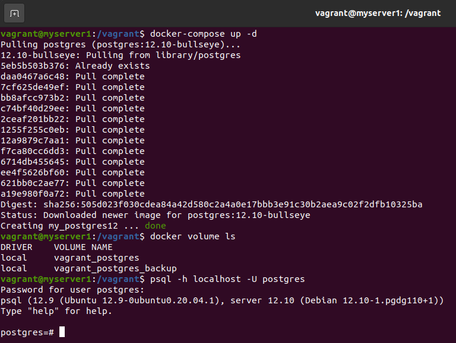

## Задача 2

В БД из задачи 1: 
- создайте пользователя test-admin-user и БД test_db
- в БД test_db создайте таблицу orders и clients (спeцификация таблиц ниже)
- предоставьте привилегии на все операции пользователю test-admin-user на таблицы БД test_db
- создайте пользователя test-simple-user  
- предоставьте пользователю test-simple-user права на SELECT/INSERT/UPDATE/DELETE данных таблиц БД test_db

Таблица orders:
- id (serial primary key)
- наименование (string)
- цена (integer)

Таблица clients:
- id (serial primary key)
- фамилия (string)
- страна проживания (string, index)
- заказ (foreign key orders)

> Для работы с СУБД предварительно установим клиент на хосте: `sudo apt install postgresql-client-12`

Приведите:
- итоговый список БД после выполнения пунктов выше
> 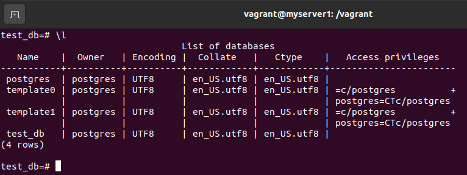
- описание таблиц (describe)
> 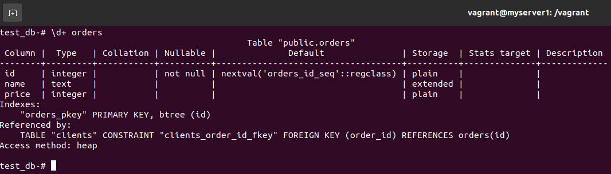
> 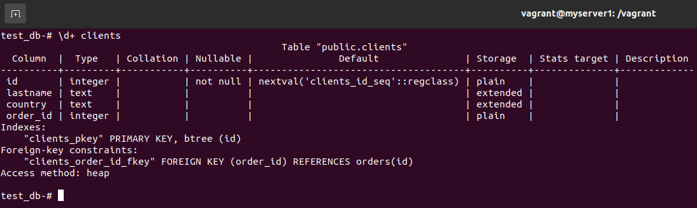
- SQL-запрос для выдачи списка пользователей с правами над таблицами test_db
> `SELECT * FROM information_schema.role_table_grants WHERE grantee not like 'postgres' AND table_catalog = 'test_db' AND table_name IN ('clients', 'orders');`
- список пользователей с правами над таблицами test_db
> 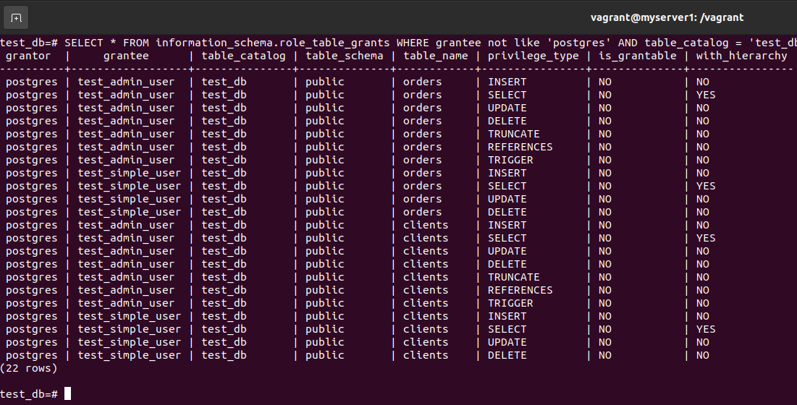

## Задача 3

Используя SQL синтаксис - наполните таблицы следующими тестовыми данными:

Таблица orders

|Наименование|цена|
|------------|----|
|Шоколад| 10 |
|Принтер| 3000 |
|Книга| 500 |
|Монитор| 7000|
|Гитара| 4000|

Таблица clients

|ФИО|Страна проживания|
|------------|----|
|Иванов Иван Иванович| USA |
|Петров Петр Петрович| Canada |
|Иоганн Себастьян Бах| Japan |
|Ронни Джеймс Дио| Russia|
|Ritchie Blackmore| Russia|

Используя SQL синтаксис:
- вычислите количество записей для каждой таблицы 
- приведите в ответе:
    - запросы 
    - результаты их выполнения.
> 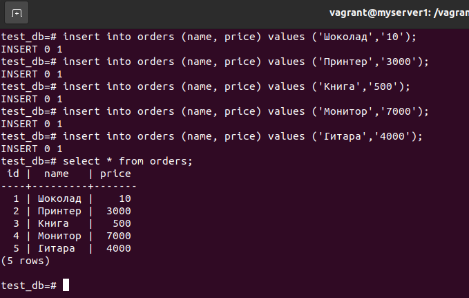
> 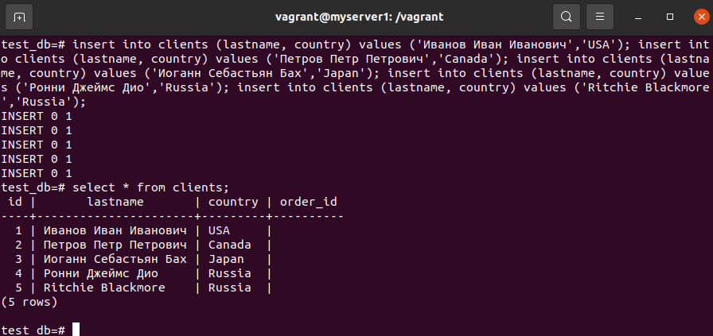
> 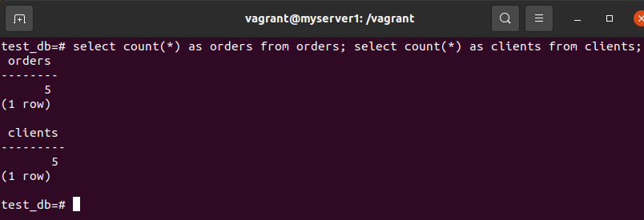
## Задача 4

Часть пользователей из таблицы clients решили оформить заказы из таблицы orders.

Используя foreign keys свяжите записи из таблиц, согласно таблице:

|ФИО|Заказ|
|------------|----|
|Иванов Иван Иванович| Книга |
|Петров Петр Петрович| Монитор |
|Иоганн Себастьян Бах| Гитара |

Приведите SQL-запросы для выполнения данных операций.
> ```
> update clients set order_id = (select id from orders where name='Книга') where lastname = 'Иванов Иван Иванович';
> update clients set order_id = (select id from orders where name='Монитор') where lastname = 'Петров Петр Петрович';
> update clients set order_id = (select id from orders where name='Гитара') where lastname = 'Иоганн Себастьян Бах';
> ```
Приведите SQL-запрос для выдачи всех пользователей, которые совершили заказ, а также вывод данного запроса.
> 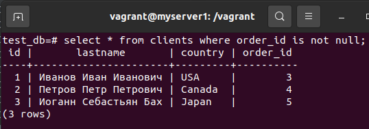

## Задача 5

Получите полную информацию по выполнению запроса выдачи всех пользователей из задачи 4 
(используя директиву EXPLAIN).

Приведите получившийся результат и объясните что значат полученные значения.
> 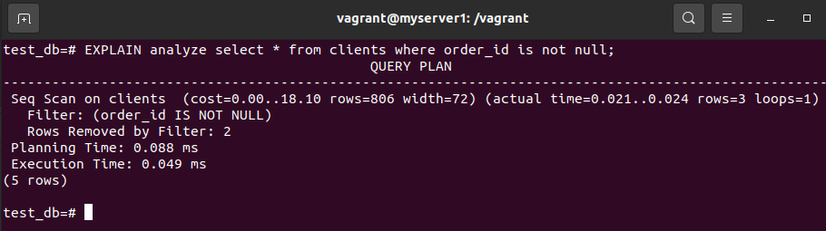
> Это план выполнения запроса. Один узел.
> Выполняется операция последовательного сканирования таблицы clients с фильтром на возвращаемые строки (Filter).  
> Значения в скобках:
- cost (первое значение) - стоимость запуска (приблизительное время до начала вывода результатов запроса). Единица может иметь разные значения в зависимости от типа выполняемой операции. В нашем случае равна seq_page_cost - приблизительной стоимости последовательного чтения одной страницы с диска.
- cost (второе значение) - приблизительная общая стоимость выполнения узла запроса (предполагается что узел выполнится целиком)
- rows - ожидаемое число строк для вывода
- width - ожидаемый средний размер строки в байтах
- actual (фактические значения)
  - time - время выполнения в миллисекундах
  - rows - фактическое количество возвращаемых строк
  - loops - количество циклов выполнения узла
- Filter - фильтр для отбора результатов запроса
- Rows removed by Filter - количество строк отброшенных фильтром
- Planning time - время затраченное на составление плана запроса
- Execution time - полное время выполнения

## Задача 6

Создайте бэкап БД test_db и поместите его в volume, предназначенный для бэкапов (см. Задачу 1).
> 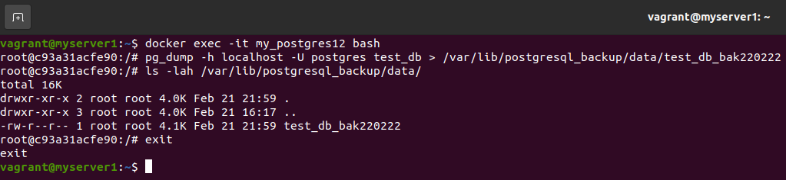

Остановите контейнер с PostgreSQL (но не удаляйте volumes).  
Поднимите новый пустой контейнер с PostgreSQL.
> 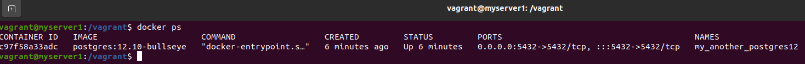

Восстановите БД test_db в новом контейнере.
> 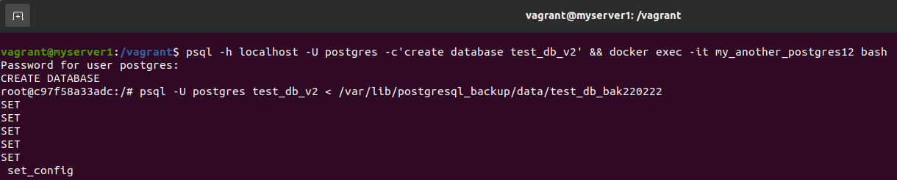
> 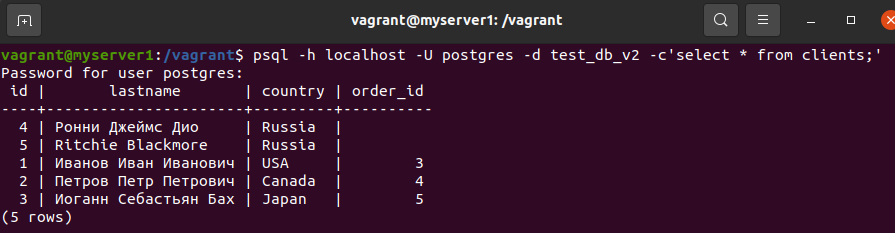

> При бэкапе были ошибки с назначением прав ролям, т.к. мы их не перенесли в новый экземпляр postgresql.
---
