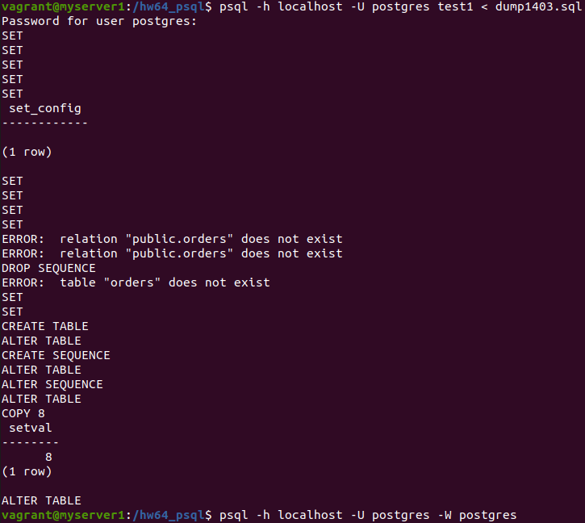

# Домашнее задание к занятию "6.4. PostgreSQL"

## Задача 1

Используя docker поднимите инстанс PostgreSQL (версию 13). Данные БД сохраните в volume.

Подключитесь к БД PostgreSQL используя `psql`.

Воспользуйтесь командой `\?` для вывода подсказки по имеющимся в `psql` управляющим командам.

**Найдите и приведите** управляющие команды для:
- вывода списка БД
> \l
- подключения к БД 
> \c[onnect] {[DBNAME|- USER|- HOST|- PORT|-] | conninfo}
- вывода списка таблиц
> \dt[S+] [PATTERN]
- вывода описания содержимого таблиц
> \d[S+]  NAME
- выхода из psql
> \q

## Задача 2

Используя `psql` создайте БД `test_database`.

Изучите [бэкап БД](https://github.com/netology-code/virt-homeworks/tree/master/06-db-04-postgresql/test_data).

Восстановите бэкап БД в `test_database`.

Перейдите в управляющую консоль `psql` внутри контейнера.

Подключитесь к восстановленной БД и проведите операцию ANALYZE для сбора статистики по таблице.

Используя таблицу [pg_stats](https://postgrespro.ru/docs/postgresql/12/view-pg-stats), найдите столбец таблицы `orders` 
с наибольшим средним значением размера элементов в байтах.

**Приведите в ответе** команду, которую вы использовали для вычисления и полученный результат.
```
test_database=# select attname, avg_width from pg_stats where tablename = 'orders' and avg_width in (select max(avg_width) from pg_stats where tablename = 'orders');
 attname | avg_width 
---------+-----------
 title   |        16
(1 row)
```

## Задача 3

Архитектор и администратор БД выяснили, что ваша таблица orders разрослась до невиданных размеров и
поиск по ней занимает долгое время. Вам, как успешному выпускнику курсов DevOps в нетологии предложили
провести разбиение таблицы на 2 (шардировать на orders_1 - price>499 и orders_2 - price<=499).

Предложите SQL-транзакцию для проведения данной операции:

```
# Добавление дочерних таблиц (шардов) методом секционирования с использованием наследования
CREATE TABLE public.orders_1 ( CHECK (price > 499) ) INHERITS (public.orders);
CREATE TABLE public.orders_2 ( CHECK (price <= 499) ) INHERITS (public.orders);

# Для последующего добавления новых строк в дочерние таблицы необходимо создать правила: 
#
CREATE RULE insert_to_orders_1 AS ON INSERT TO public.orders WHERE (price > 499)
DO INSTEAD INSERT INTO public.orders_1 VALUES (NEW.*);

CREATE RULE insert_to_orders_2 AS ON INSERT TO public.orders WHERE (price <= 499)
DO INSTEAD INSERT INTO public.orders_2 VALUES (NEW.*);  
```

Можно ли было изначально исключить "ручное" разбиение при проектировании таблицы orders?
> Да можно, если на этапе создания таблицы использовать декларативное секционирование. Для этого необходимо при создании таблицы использовать предложение PARTITION BY, а при создании секций этой таблицы предложение PARTITION OF: 
```
# Добавление секционированной таблицы (является виртуальной)
CREATE TABLE orders (
    id         integer SERIAL PRIMARY KEY,
    title      character varying(80) NOT NULL,
    price      integer DEFAULT 0
) PARTITION BY RANGE (price);

# В документации также рекомендуется создавать индекс для столбцов образующих ключ разбиения:

CREATE INDEX on orders (price);

# Добавление таблиц, являющихся секциями таблицы order:
CREATE TABLE orders_1 PARTITION OF orders
    FOR VALUES FROM (499) TO (MAXVALUE);

CREATE TABLE orders_2 PARTITION OF orders
    FOR VALUES FROM (MINVALUE) TO (499);    
```

## Задача 4

Используя утилиту `pg_dump` создайте бекап БД `test_database`.

Как бы вы доработали бэкап-файл, чтобы добавить уникальность значения столбца `title` для таблиц `test_database`?
> Необходимо в секции создания таблицы orders добавить ограничение уникальности по столбцу title:
```
--
-- PostgreSQL database dump
--

-- Dumped from database version 13.6 (Debian 13.6-1.pgdg110+1)
-- Dumped by pg_dump version 13.6 (Debian 13.6-1.pgdg110+1)

SET statement_timeout = 0;
SET lock_timeout = 0;
SET idle_in_transaction_session_timeout = 0;
SET client_encoding = 'UTF8';
SET standard_conforming_strings = on;
SELECT pg_catalog.set_config('search_path', '', false);
SET check_function_bodies = false;
SET xmloption = content;
SET client_min_messages = warning;
SET row_security = off;

ALTER TABLE ONLY public.orders DROP CONSTRAINT orders_pkey;
ALTER TABLE public.orders ALTER COLUMN id DROP DEFAULT;
DROP SEQUENCE public.orders_id_seq;
DROP TABLE public.orders;
SET default_tablespace = '';

SET default_table_access_method = heap;

--
-- Name: orders; Type: TABLE; Schema: public; Owner: postgres
--

CREATE TABLE public.orders (
    id integer NOT NULL,
    title character varying(80) NOT NULL,
    price integer DEFAULT 0,
    CONSTRAINT title_unq UNIQUE (title)
);

```
> Залил измененный дамп в новую БД test1 и проверил добавление строки с неуникальным title:

```
Postgres=# \c test1
psql (12.9 (Ubuntu 12.9-0ubuntu0.20.04.1), server 13.6 (Debian 13.6-1.pgdg110+1))
WARNING: psql major version 12, server major version 13.
         Some psql features might not work.
You are now connected to database "test1" as user "postgres".
test1=# select * from orders;
 id |        title         | price 
----+----------------------+-------
  1 | War and peace        |   100
  2 | My little database   |   500
  3 | Adventure psql time  |   300
  4 | Server gravity falls |   300
  5 | Log gossips          |   123
  6 | WAL never lies       |   900
  7 | Me and my bash-pet   |   499
  8 | Dbiezdmin            |   501
(8 rows)

test1=# insert into orders (title,price) VALUES ('War and peace', 200);
ERROR:  duplicate key value violates unique constraint "title_unq"
DETAIL:  Key (title)=(War and peace) already exists.
```
---
