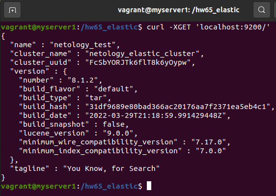

# Домашнее задание к занятию "6.5. Elasticsearch"

## Задача 1

В этом задании вы потренируетесь в:
- установке elasticsearch
- первоначальном конфигурировании elastcisearch
- запуске elasticsearch в docker

Используя докер образ [centos:7](https://hub.docker.com/_/centos) как базовый и 
[документацию по установке и запуску Elastcisearch](https://www.elastic.co/guide/en/elasticsearch/reference/current/targz.html):

- составьте Dockerfile-манифест для elasticsearch
- соберите docker-образ и сделайте `push` в ваш docker.io репозиторий
- запустите контейнер из получившегося образа и выполните запрос пути `/` c хост-машины

Требования к `elasticsearch.yml`:
- данные `path` должны сохраняться в `/var/lib`
- имя ноды должно быть `netology_test`

В ответе приведите:
- текст Dockerfile манифеста

>Способ загрузки дистрибутивов, указанный в официальной документации (wget) реализовать не удалось из-за ограничений по IP.
> Поэтому скачал дистрибутивы отдельно и использовал копирование в ФС контейнера.
```
FROM centos:7

COPY elasticsearch-8.1.2-linux-x86_64.tar.gz elasticsearch-8.1.2-linux-x86_64.tar.gz.sha512 ./

RUN yum update -y && \
	yum install java-11-openjdk-devel -y && \
	yum install perl-Digest-SHA -y && \
	shasum -a 512 -c elasticsearch-8.1.2-linux-x86_64.tar.gz.sha512 && \
	tar -xzf elasticsearch-8.1.2-linux-x86_64.tar.gz && \
	rm -vf elasticsearch-8.1.2-linux-x86_64.tar.gz elasticsearch-8.1.2-linux-x86_64.tar.gz.sha512 && \
	mkdir {/var/lib/data,/var/lib/logs}

ENV ES_HOME=/elasticsearch-8.1.2

ADD elasticsearch.yml /elasticsearch-8.1.2/config/

RUN groupadd elastic && useradd elastic -g elastic -p elastic && \
	chown -R elastic:elastic elasticsearch-8.1.2/ && \
	chown elastic:elastic /var/lib/data && \
	chown elastic:elastic /var/lib/logs

USER elastic

CMD ["/usr/sbin/init"]

CMD ["elasticsearch-8.1.2/bin/elasticsearch"]
```
- ссылку на образ в репозитории dockerhub  
[образ на Dockerhub](https://hub.docker.com/repository/docker/bobro777/elastic)
- ответ `elasticsearch` на запрос пути `/` в json виде  



Подсказки:
- возможно вам понадобится установка пакета perl-Digest-SHA для корректной работы пакета shasum
- при сетевых проблемах внимательно изучите кластерные и сетевые настройки в elasticsearch.yml
- при некоторых проблемах вам поможет docker директива ulimit
- elasticsearch в логах обычно описывает проблему и пути ее решения

Далее мы будем работать с данным экземпляром elasticsearch.

## Задача 2

В этом задании вы научитесь:
- создавать и удалять индексы
- изучать состояние кластера
- обосновывать причину деградации доступности данных

Ознакомтесь с [документацией](https://www.elastic.co/guide/en/elasticsearch/reference/current/indices-create-index.html) 
и добавьте в `elasticsearch` 3 индекса, в соответствии со таблицей:

| Имя | Количество реплик | Количество шард |
|-----|-------------------|-----------------|
| ind-1| 0 | 1 |
| ind-2 | 1 | 2 |
| ind-3 | 2 | 4 |

>

Получите список индексов и их статусов, используя API и **приведите в ответе** на задание.
```
$ curl -XGET localhost:9200/_cat/indices/?v
health status index uuid                   pri rep docs.count docs.deleted store.size pri.store.size
green  open   ind-1 7FOoNSLASxiidXkh453d1A   1   0          0            0       225b           225b
yellow open   ind-3 WkerI2uVSaO-pAv_ndFyFg   4   2          0            0       900b           900b
yellow open   ind-2 O7fi-k02QNu6lJvYFMIQqQ   2   1          0            0       450b           450b

```

Получите состояние кластера `elasticsearch`, используя API.
```
$ curl -XGET localhost:9200/_cluster/health/?pretty
{
  "cluster_name" : "netology_elastic_cluster",
  "status" : "yellow",
  "timed_out" : false,
  "number_of_nodes" : 1,
  "number_of_data_nodes" : 1,
  "active_primary_shards" : 8,
  "active_shards" : 8,
  "relocating_shards" : 0,
  "initializing_shards" : 0,
  "unassigned_shards" : 10,
  "delayed_unassigned_shards" : 0,
  "number_of_pending_tasks" : 0,
  "number_of_in_flight_fetch" : 0,
  "task_max_waiting_in_queue_millis" : 0,
  "active_shards_percent_as_number" : 44.44444444444444
}
```
> Количество шард 8, а не 7, т.к. по умолчанию был установлен скрытый индекс .geoip_databases с одним шардом.
> 

Как вы думаете, почему часть индексов и кластер находится в состоянии yellow?
```
$ curl -XGET localhost:9200/_cat/shards/in*?v
index shard prirep state      docs store ip         node
ind-2 1     p      STARTED       0  225b 172.17.0.2 netology_test
ind-2 1     r      UNASSIGNED                       
ind-2 0     p      STARTED       0  225b 172.17.0.2 netology_test
ind-2 0     r      UNASSIGNED                       
ind-1 0     p      STARTED       0  225b 172.17.0.2 netology_test
ind-3 3     p      STARTED       0  225b 172.17.0.2 netology_test
ind-3 3     r      UNASSIGNED                       
ind-3 3     r      UNASSIGNED                       
ind-3 1     p      STARTED       0  225b 172.17.0.2 netology_test
ind-3 1     r      UNASSIGNED                       
ind-3 1     r      UNASSIGNED                       
ind-3 2     p      STARTED       0  225b 172.17.0.2 netology_test
ind-3 2     r      UNASSIGNED                       
ind-3 2     r      UNASSIGNED                       
ind-3 0     p      STARTED       0  225b 172.17.0.2 netology_test
ind-3 0     r      UNASSIGNED                       
ind-3 0     r      UNASSIGNED                       

```
> Все primary шарды находятся в состоянии started. У первого индекса нет неназначенных replica шардов, т.к. количество реплик для него - 0. И таким образом индекс находится в статусе green.
> В двух остальных индексах есть неназначенные replica шарды (2 и 8 штук), поэтому статус этих индексов и всего кластера - yellow.  
> Это произошло по причине создания всего одной ноды в кластере. Чтобы сделать статус кластера green, необходимо добавить в него минимум 3 ноды для размещения всех реплик.

Удалите все индексы.
```
$ curl -XDELETE localhost:9200/ind*
{"acknowledged":true}
```
**Важно**

При проектировании кластера elasticsearch нужно корректно рассчитывать количество реплик и шард,
иначе возможна потеря данных индексов, вплоть до полной, при деградации системы.

## Задача 3

В данном задании вы научитесь:
- создавать бэкапы данных
- восстанавливать индексы из бэкапов

Создайте директорию `{путь до корневой директории с elasticsearch в образе}/snapshots`.

Используя API [зарегистрируйте](https://www.elastic.co/guide/en/elasticsearch/reference/current/snapshots-register-repository.html#snapshots-register-repository) 
данную директорию как `snapshot repository` c именем `netology_backup`.

**Приведите в ответе** запрос API и результат вызова API для создания репозитория.

```
vagrant@myserver1:~$ docker exec -it my_elastic bash
[elastic@833fb8bbb7b7 /]$ mkdir elasticsearch-8.1.2/snapshots
[elastic@833fb8bbb7b7 /]$ vi elasticsearch-8.1.2/config/elasticsearch.yml
```

```
vagrant@myserver1:~$ curl -XPUT localhost:9200/_snapshot/netology_backup -H 'Content-Type: application/json' -d '{"type": "fs", "settings" : {"location": "/elasticsearch-8.1.2/snapshots"}}'
{"acknowledged":true}
vagrant@myserver1:~$ curl -XGET localhost:9200/_snapshot/?pretty
{
  "netology_backup" : {
    "type" : "fs",
    "settings" : {
      "location" : "/elasticsearch-8.1.2/snapshots"
    }
  }
}

```

Создайте индекс `test` с 0 реплик и 1 шардом и **приведите в ответе** список индексов.
```
$ curl -XPUT localhost:9200/test -H 'Content-Type: application/json' -d '{"settings": {"number_of_shards": 1, "number_of_replicas": 0}}'
{"acknowledged":true,"shards_acknowledged":true,"index":"test"}
$ curl -XGET localhost:9200/_cat/indices/?v
health status index uuid                   pri rep docs.count docs.deleted store.size pri.store.size
green  open   test  uUXCCx5AR7Og_XkwAUHskg   1   0          0            0       225b           225b
```

[Создайте `snapshot`](https://www.elastic.co/guide/en/elasticsearch/reference/current/snapshots-take-snapshot.html) 
состояния кластера `elasticsearch`.
```
$ curl -XPUT localhost:9200/_snapshot/netology_backup/netology080422?wait_for_completion=true
```
**Приведите в ответе** список файлов в директории со `snapshot`ами.
```
[elastic@833fb8bbb7b7 /]$ ll /elasticsearch-8.1.2/snapshots/
total 36
-rw-r--r-- 1 elastic elastic   847 Apr  8 14:57 index-0
-rw-r--r-- 1 elastic elastic     8 Apr  8 14:57 index.latest
drwxr-xr-x 4 elastic elastic  4096 Apr  8 14:57 indices
-rw-r--r-- 1 elastic elastic 18295 Apr  8 14:57 meta-oz2KyWELRbaZPrZoeLxmHg.dat
-rw-r--r-- 1 elastic elastic   359 Apr  8 14:57 snap-oz2KyWELRbaZPrZoeLxmHg.dat
```
Удалите индекс `test` и создайте индекс `test-2`. **Приведите в ответе** список индексов.
```
$ curl -XGET localhost:9200/_cat/indices/?v
health status index  uuid                   pri rep docs.count docs.deleted store.size pri.store.size
green  open   test-2 i4vc3RjxRtq7vKWj8dw6iw   1   0          0            0       225b           225b
```
[Восстановите](https://www.elastic.co/guide/en/elasticsearch/reference/current/snapshots-restore-snapshot.html) состояние
кластера `elasticsearch` из `snapshot`, созданного ранее. 

**Приведите в ответе** запрос к API восстановления и итоговый список индексов.
```
$ curl -XPOST localhost:9200/_snapshot/netology_backup/netology080422/_restore
{"accepted":true}
$ curl -XGET localhost:9200/_cat/indices/?v
health status index  uuid                   pri rep docs.count docs.deleted store.size pri.store.size
green  open   test-2 i4vc3RjxRtq7vKWj8dw6iw   1   0          0            0       225b           225b
green  open   test   DnSSun8LRs2CYqKr0JVmkg   1   0          0            0       225b           225b
```
---
