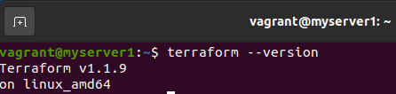
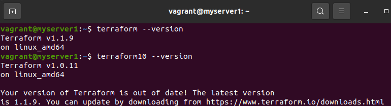

# Домашнее задание к занятию "7.1. Инфраструктура как код"

## Задача 1. Выбор инструментов. 
 
### Легенда
 
Через час совещание на котором менеджер расскажет о новом проекте. Начать работу над которым надо 
будет уже сегодня. 
На данный момент известно, что это будет сервис, который ваша компания будет предоставлять внешним заказчикам.
Первое время, скорее всего, будет один внешний клиент, со временем внешних клиентов станет больше.

Так же по разговорам в компании есть вероятность, что техническое задание еще не четкое, что приведет к большому
количеству небольших релизов, тестирований интеграций, откатов, доработок, то есть скучно не будет.  
   
Вам, как девопс инженеру, будет необходимо принять решение об инструментах для организации инфраструктуры.
На данный момент в вашей компании уже используются следующие инструменты: 
- остатки Сloud Formation, 
- некоторые образы сделаны при помощи Packer,
- год назад начали активно использовать Terraform, 
- разработчики привыкли использовать Docker, 
- уже есть большая база Kubernetes конфигураций, 
- для автоматизации процессов используется Teamcity, 
- также есть совсем немного Ansible скриптов, 
- и ряд bash скриптов для упрощения рутинных задач.  

Для этого в рамках совещания надо будет выяснить подробности о проекте, что бы в итоге определиться с инструментами:

1. Какой тип инфраструктуры будем использовать для этого проекта: изменяемый или не изменяемый?
1. Будет ли центральный сервер для управления инфраструктурой?
1. Будут ли агенты на серверах?
1. Будут ли использованы средства для управления конфигурацией или инициализации ресурсов? 
 
В связи с тем, что проект стартует уже сегодня, в рамках совещания надо будет определиться со всеми этими вопросами.

### В результате задачи необходимо

1. Ответить на четыре вопроса представленных в разделе "Легенда". 
1. Какие инструменты из уже используемых вы хотели бы использовать для нового проекта? 
1. Хотите ли рассмотреть возможность внедрения новых инструментов для этого проекта? 

Если для ответа на эти вопросы недостаточно информации, то напишите какие моменты уточните на совещании.

> На совещании необходимо сразу уточнить ориентировочный текущий бюджет под одного клиента и прогноз по увеличению клиентской базы и пропорциональность бюджета к этому увеличению.  
> В любом случае можно отказаться от Cloud Formation, как от узкоспециализированного продукта (AWS) с малым сообществом и раз уже есть годовая практика с Terraform.  
> Скрипты Ansible оставляем про запас. Особенно полезно будет, если можно воспользоваться наработками для первичной настройки инфраструктуры (процедурный подход с изменяемым типом инфраструктуры). В процессе причесывания ТЗ и настройки процессов можно будет отказаться от Ansible или использовать частично существующие наработки в паре с Terraform.
> Таким образом в качестве главного инструмента выбираем средство инициализации ресурсов Terraform с вытекающими декларативным языком описания и неизменяемой инфраструктурой.  
> Центральный сервер управления инфраструктурой и агенты на серверах приложений на первом этапе вводить не стоит для экономии бюджета и ресурсов. Но по мере увеличения количества клиентов и, соответственно, разрастания инфраструктуры можно/придётся добавить для упрощения масштабирования и контроля за состоянием. В данном случае подразумевается Kubernetes (Terraform и Ansible таких возможностей по умолчанию не предоставляют).  
> В качестве средства CI/CD можно оставить Teamcity, но для экономии на лицензиях можно внедрить для использования опенсорсный Jenkins. Тем более что у последнего огромное сообщество и существует большое количество плагинов под любые задачи.  
> И естественно с первого этапа используем контейнеризацию Docker, т.к. разработчики уже привыкли и все другие инструменты хорошо с ним интегрируются.
> 
> В качестве новых инструментов обязательно нужно рассмотреть настройку мониторинга комплекса. Например, стек ELK или Prometheus+Grafana.  
> Также не лишним будет обсудить планируемые к использованию СУБД, чтобы понимать специфику их разворачивания и мониторинга выбранными инструментами.
> 
## Задача 2. Установка терраформ. 

Официальный сайт: https://www.terraform.io/

Установите терраформ при помощи менеджера пакетов используемого в вашей операционной системе.
В виде результата этой задачи приложите вывод команды `terraform --version`.  

## Задача 3. Поддержка легаси кода. 

В какой-то момент вы обновили терраформ до новой версии, например с 0.12 до 0.13. 
А код одного из проектов настолько устарел, что не может работать с версией 0.13. 
В связи с этим необходимо сделать так, чтобы вы могли одновременно использовать последнюю версию терраформа установленную при помощи
штатного менеджера пакетов и устаревшую версию 0.12. 

В виде результата этой задачи приложите вывод `--version` двух версий терраформа доступных на вашем компьютере 
или виртуальной машине.
> Скачаем с официального ресурса бинарник необходимой версии (список версий можно посмотреть в changelog). Например, версию 1.0.11  
> Распакуем в любую созданную директорию бинарный файл и поместим символическую ссылку на него в  /usr/bin/  
> Выдадим права на запуск файла.  

---
