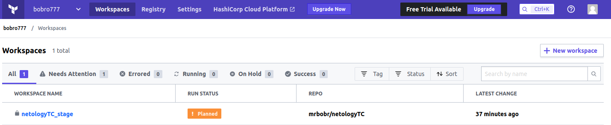
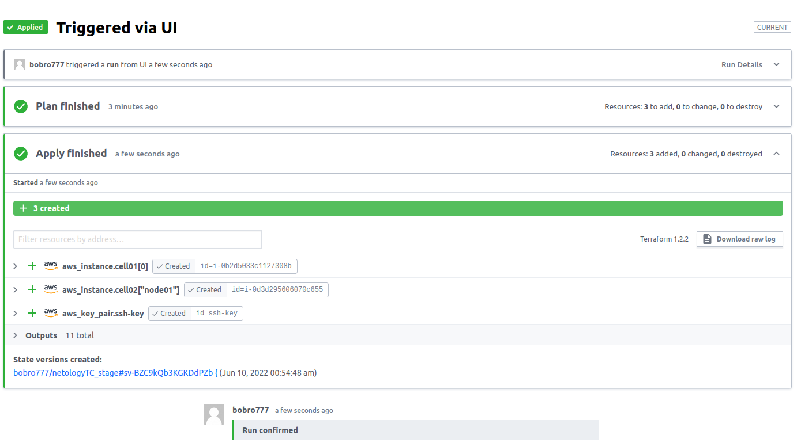

# Домашнее задание к занятию "7.4. Средства командной работы над инфраструктурой."

## Задача 1. Настроить terraform cloud (необязательно, но крайне желательно).

В это задании предлагается познакомиться со средством командой работы над инфраструктурой предоставляемым
разработчиками терраформа. 

1. Зарегистрируйтесь на [https://app.terraform.io/](https://app.terraform.io/).
(регистрация бесплатная и не требует использования платежных инструментов).
2. Создайте в своем github аккаунте (или другом хранилище репозиториев) отдельный репозиторий с
 конфигурационными файлами прошлых занятий (или воспользуйтесь любым простым конфигом).
> [Репозиторий с конфигами из предыдущего ДЗ](https://github.com/mrbobr/netologyTC)
3. Зарегистрируйте этот репозиторий в [https://app.terraform.io/](https://app.terraform.io/).
4. Выполните plan и apply. 

В качестве результата задания приложите снимок экрана с успешным применением конфигурации.  




## Задача 2. Написать серверный конфиг для атлантиса. 

Смысл задания – познакомиться с документацией о
 [серверной](https://www.runatlantis.io/docs/server-side-repo-config.html) конфигурации и конфигурации уровня 
 [репозитория](https://www.runatlantis.io/docs/repo-level-atlantis-yaml.html).

Создай `server.yaml` который скажет атлантису:
1. Укажите, что атлантис должен работать только для репозиториев в вашем github (или любом другом) аккаунте.
1. На стороне клиентского конфига разрешите изменять `workflow`, то есть для каждого репозитория можно 
будет указать свои дополнительные команды. 
1. В `workflow` используемом по-умолчанию сделайте так, что бы во время планирования не происходил `lock` состояния.

Создай `atlantis.yaml` который, если поместить в корень terraform проекта, скажет атлантису:
1. Надо запускать планирование и аплай для двух воркспейсов `stage` и `prod`.
1. Необходимо включить автопланирование при изменении любых файлов `*.tf`.

В качестве результата приложите ссылку на файлы `server.yaml` и `atlantis.yaml`.  
> [server.yaml](src/atlantis/server.yaml)  
> [atlantis.yaml](src/atlantis/atlantis.yaml)
## Задача 3. Знакомство с каталогом модулей. 

1. В [каталоге модулей](https://registry.terraform.io/browse/modules) найдите официальный модуль от aws для создания
`ec2` инстансов. 
2. Изучите как устроен модуль. Задумайтесь, будете ли в своем проекте использовать этот модуль или непосредственно 
ресурс `aws_instance` без помощи модуля?
3. В рамках предпоследнего задания был создан ec2 при помощи ресурса `aws_instance`. 
Создайте аналогичный инстанс при помощи найденного модуля.   

В качестве результата задания приложите ссылку на созданный блок конфигураций. 

> [tf_module](src/tf_module)

<details>
 <summary>terraform plan (<i>развернуть/свернуть</i>)</summary>

```
vagrant@myserver1:/0704tfmodule$ terraform plan

Terraform used the selected providers to generate the following execution plan. Resource actions are indicated with the following symbols:
  + create

Terraform will perform the following actions:

  # aws_key_pair.ssh-key will be created
  + resource "aws_key_pair" "ssh-key" {
      + arn             = (known after apply)
      + fingerprint     = (known after apply)
      + id              = (known after apply)
      + key_name        = "ssh-key"
      + key_name_prefix = (known after apply)
      + key_pair_id     = (known after apply)
      + public_key      = "ssh-rsa AAAAB3N..."
      + tags_all        = (known after apply)
    }

  # module.ec2_instance["server01"].aws_instance.this[0] will be created
  + resource "aws_instance" "this" {
      + ami                                  = "ami-ebd02392"
      + arn                                  = (known after apply)
      + associate_public_ip_address          = true
      + availability_zone                    = (known after apply)
      + cpu_core_count                       = (known after apply)
      + cpu_threads_per_core                 = (known after apply)
      + disable_api_termination              = (known after apply)
      + ebs_optimized                        = (known after apply)
      + get_password_data                    = false
      + host_id                              = (known after apply)
      + id                                   = (known after apply)
      + instance_initiated_shutdown_behavior = (known after apply)
      + instance_state                       = (known after apply)
      + instance_type                        = "t2.micro"
      + ipv6_address_count                   = (known after apply)
      + ipv6_addresses                       = (known after apply)
      + key_name                             = "ssh-key"
      + monitoring                           = true
      + outpost_arn                          = (known after apply)
      + password_data                        = (known after apply)
      + placement_group                      = (known after apply)
      + placement_partition_number           = (known after apply)
      + primary_network_interface_id         = (known after apply)
      + private_dns                          = (known after apply)
      + private_ip                           = (known after apply)
      + public_dns                           = (known after apply)
      + public_ip                            = (known after apply)
      + secondary_private_ips                = (known after apply)
      + security_groups                      = (known after apply)
      + source_dest_check                    = true
      + subnet_id                            = "subnet-04c6eb4503214df5e"
      + tags                                 = {
          + "Environment" = "dev"
          + "Name"        = "instance-server01"
          + "Terraform"   = "true"
        }
      + tags_all                             = {
          + "Environment" = "dev"
          + "Name"        = "instance-server01"
          + "Terraform"   = "true"
        }
      + tenancy                              = (known after apply)
      + user_data                            = (known after apply)
      + user_data_base64                     = (known after apply)
      + user_data_replace_on_change          = false
      + volume_tags                          = {
          + "Name" = "instance-server01"
        }
      + vpc_security_group_ids               = [
          + "sg-0a8d53221ae0857c7",
        ]

      + capacity_reservation_specification {
          + capacity_reservation_preference = (known after apply)

          + capacity_reservation_target {
              + capacity_reservation_id                 = (known after apply)
              + capacity_reservation_resource_group_arn = (known after apply)
            }
        }

      + credit_specification {}

      + ebs_block_device {
          + delete_on_termination = true
          + device_name           = "/dev/sda1"
          + encrypted             = (known after apply)
          + iops                  = (known after apply)
          + kms_key_id            = (known after apply)
          + snapshot_id           = (known after apply)
          + throughput            = (known after apply)
          + volume_id             = (known after apply)
          + volume_size           = 8
          + volume_type           = "standard"
        }

      + enclave_options {
          + enabled = (known after apply)
        }

      + ephemeral_block_device {
          + device_name  = (known after apply)
          + no_device    = (known after apply)
          + virtual_name = (known after apply)
        }

      + maintenance_options {
          + auto_recovery = (known after apply)
        }

      + metadata_options {
          + http_endpoint               = "enabled"
          + http_put_response_hop_limit = 1
          + http_tokens                 = "optional"
          + instance_metadata_tags      = "disabled"
        }

      + network_interface {
          + delete_on_termination = (known after apply)
          + device_index          = (known after apply)
          + network_card_index    = (known after apply)
          + network_interface_id  = (known after apply)
        }

      + root_block_device {
          + delete_on_termination = (known after apply)
          + device_name           = (known after apply)
          + encrypted             = (known after apply)
          + iops                  = (known after apply)
          + kms_key_id            = (known after apply)
          + tags                  = (known after apply)
          + throughput            = (known after apply)
          + volume_id             = (known after apply)
          + volume_size           = (known after apply)
          + volume_type           = (known after apply)
        }

      + timeouts {}
    }

  # module.ec2_instance["server02"].aws_instance.this[0] will be created
  + resource "aws_instance" "this" {
      + ami                                  = "ami-ebd02392"
      + arn                                  = (known after apply)
      + associate_public_ip_address          = true
      + availability_zone                    = (known after apply)
      + cpu_core_count                       = (known after apply)
      + cpu_threads_per_core                 = (known after apply)
      + disable_api_termination              = (known after apply)
      + ebs_optimized                        = (known after apply)
      + get_password_data                    = false
      + host_id                              = (known after apply)
      + id                                   = (known after apply)
      + instance_initiated_shutdown_behavior = (known after apply)
      + instance_state                       = (known after apply)
      + instance_type                        = "t2.micro"
      + ipv6_address_count                   = (known after apply)
      + ipv6_addresses                       = (known after apply)
      + key_name                             = "ssh-key"
      + monitoring                           = true
      + outpost_arn                          = (known after apply)
      + password_data                        = (known after apply)
      + placement_group                      = (known after apply)
      + placement_partition_number           = (known after apply)
      + primary_network_interface_id         = (known after apply)
      + private_dns                          = (known after apply)
      + private_ip                           = (known after apply)
      + public_dns                           = (known after apply)
      + public_ip                            = (known after apply)
      + secondary_private_ips                = (known after apply)
      + security_groups                      = (known after apply)
      + source_dest_check                    = true
      + subnet_id                            = "subnet-04c6eb4503214df5e"
      + tags                                 = {
          + "Environment" = "dev"
          + "Name"        = "instance-server02"
          + "Terraform"   = "true"
        }
      + tags_all                             = {
          + "Environment" = "dev"
          + "Name"        = "instance-server02"
          + "Terraform"   = "true"
        }
      + tenancy                              = (known after apply)
      + user_data                            = (known after apply)
      + user_data_base64                     = (known after apply)
      + user_data_replace_on_change          = false
      + volume_tags                          = {
          + "Name" = "instance-server02"
        }
      + vpc_security_group_ids               = [
          + "sg-0a8d53221ae0857c7",
        ]

      + capacity_reservation_specification {
          + capacity_reservation_preference = (known after apply)

          + capacity_reservation_target {
              + capacity_reservation_id                 = (known after apply)
              + capacity_reservation_resource_group_arn = (known after apply)
            }
        }

      + credit_specification {}

      + ebs_block_device {
          + delete_on_termination = true
          + device_name           = "/dev/sda1"
          + encrypted             = (known after apply)
          + iops                  = (known after apply)
          + kms_key_id            = (known after apply)
          + snapshot_id           = (known after apply)
          + throughput            = (known after apply)
          + volume_id             = (known after apply)
          + volume_size           = 8
          + volume_type           = "standard"
        }

      + enclave_options {
          + enabled = (known after apply)
        }

      + ephemeral_block_device {
          + device_name  = (known after apply)
          + no_device    = (known after apply)
          + virtual_name = (known after apply)
        }

      + maintenance_options {
          + auto_recovery = (known after apply)
        }

      + metadata_options {
          + http_endpoint               = "enabled"
          + http_put_response_hop_limit = 1
          + http_tokens                 = "optional"
          + instance_metadata_tags      = "disabled"
        }

      + network_interface {
          + delete_on_termination = (known after apply)
          + device_index          = (known after apply)
          + network_card_index    = (known after apply)
          + network_interface_id  = (known after apply)
        }

      + root_block_device {
          + delete_on_termination = (known after apply)
          + device_name           = (known after apply)
          + encrypted             = (known after apply)
          + iops                  = (known after apply)
          + kms_key_id            = (known after apply)
          + tags                  = (known after apply)
          + throughput            = (known after apply)
          + volume_id             = (known after apply)
          + volume_size           = (known after apply)
          + volume_type           = (known after apply)
        }

      + timeouts {}
    }

Plan: 3 to add, 0 to change, 0 to destroy.

Changes to Outputs:
  + Instances_IDs         = {
      + "server01" = (known after apply)
      + "server02" = (known after apply)
    }
  + Instances_private_IPs = {
      + "server01" = (known after apply)
      + "server02" = (known after apply)
    }
  + Instances_public_IPs  = {
      + "server01" = (known after apply)
      + "server02" = (known after apply)
    }
  + aws_current_region    = "us-west-2"

──────────────────────────────────────────────────────────────────────────────────────────────────────────────────────────────────────────────────────────────────────────────────────────────────────────

Note: You didn't use the -out option to save this plan, so Terraform can't guarantee to take exactly these actions if you run "terraform apply" now.
vagrant@myserver1:/0704tfmodule$ 

```

</details>

---
